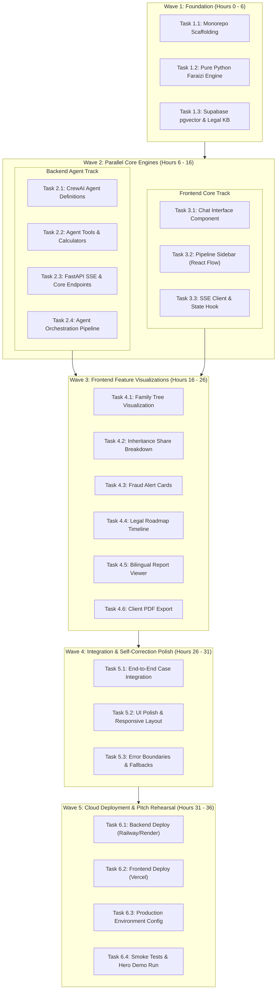

# HaqDar (حقدار) — Execution Roadmap (ROADMAP.md)

**Status:** FINALIZED  
**Target Deadline:** 1.5 Days (36 Hours) — HEC × PakAngels GenAI Hackathon  
**Execution Strategy:** Multi-Wave Parallel Engineering  
**Architecture Spec Reference:** [SPEC.md](file:///home/ilyan/og/.gsd/SPEC.md)  

---

## 1. Execution Architecture & Wave Overview

To deliver a fully functional, verifiable MVP within a stringent 36-hour timeline, tasks are partitioned into **5 sequential execution waves** across **6 core phases**. Tasks inside the same wave can be executed concurrently.



---

## 2. Hackathon 36-Hour Sprint Schedule

| Sprint Phase | Hours | Focus Area | Deliverable Gate |
|---|---|---|---|
| **Wave 1: Foundation** | 00:00 – 06:00 | Scaffolding, Math Engine, Vector DB | Unit tests passing for Faraizi calculations; DB seeded |
| **Wave 2: Core Engines** | 06:00 – 16:00 | CrewAI Agents, FastAPI SSE, Frontend Core | Working SSE pipeline streaming agent thoughts to React Flow |
| **Wave 3: Feature Suite** | 16:00 – 26:00 | Tree Viz, Fraud Cards, Legal Roadmap, PDF | Full visual dossier populated from real agent outputs |
| **Wave 4: Polish & QA** | 26:00 – 31:00 | Hero Moment Self-Correction, Mobile/Web Polish | Reliable self-correction loop executing in under 20 seconds |
| **Wave 5: Deploy & Demo** | 31:00 – 36:00 | Production Cloud Deployments, Demo Rehearsal | Live public URLs running flawlessly on production environments |

---

## 3. Detailed Work Breakdown by Phase

### Phase 1: Foundation (Wave 1 — Hours 0 to 6)

#### Task 1.1: Project Scaffolding (Monorepo Structure)
- **Description:** Establish the clean monorepo architecture separating the Next.js frontend and FastAPI backend. Configure workspace tooling, linting, shared TypeScript interfaces, and Python virtual environment with dependency pinning.
- **Estimated Time:** 1.5 hours
- **Dependencies:** None
- **Verification Criteria:**
  - [ ] Frontend initializes clean with `npm run dev` on port 3000.
  - [ ] Backend starts with `uvicorn main:app --reload` on port 8000.
  - [ ] CORS is configured allowing requests from `localhost:3000` to `localhost:8000`.
  - [ ] Health check endpoint `GET /api/health` returns `{"status": "healthy"}`.

#### Task 1.2: Faraizi Calculation Engine (Pure Python)
- **Description:** Implement pure Python Islamic inheritance computation engine (`engine/faraizi.py`) using `fractions.Fraction`. Hard-code Quranic rules for Zawil-Furood (Sharers), Asabah (Residuaries), Awl (Proportional reduction), and Radd (Return). LLMs are completely excluded from math routines.
- **Estimated Time:** 2.5 hours
- **Dependencies:** None
- **Verification Criteria:**
  - [ ] Pure deterministic execution with 0% floating-point precision error.
  - [ ] Test Suite validates 10 standard benchmark cases (e.g. Wife + Mother + 2 Sons + 1 Daughter = exactly 120/120).
  - [ ] Supports both single and multiple wives, surviving parents, and varying offspring counts.
  - [ ] Output schema provides numerator, denominator, exact float percentage, and allocated PKR currency.

#### Task 1.3: Supabase pgvector Setup & Legal Knowledge Base Seeding
- **Description:** Configure Supabase instance with `pgvector` enabled. Create the `legal_knowledge_base` table and run a Python seeding script embedding Pakistani statutes (Enforcement of Women's Property Rights Act 2020, PPC Section 498A, Land Revenue Act 1967) and landmark Supreme Court rulings (*Ghulam Murtaza v. Mst. Ashiq Noor*).
- **Estimated Time:** 2.0 hours
- **Dependencies:** None
- **Verification Criteria:**
  - [ ] Table `legal_knowledge_base` successfully provisioned with vector index.
  - [ ] Seeding script ingests minimum 15 high-value statutory clauses and judicial precedents.
  - [ ] Similarity search query for *"fraudulent oral gift hiba near death"* returns top-3 relevant judicial precedents with cosine similarity > 0.75.

---

### Phase 2: Backend Agents (Wave 2 — Hours 6 to 16)

#### Task 2.1: CrewAI Agent Definitions (All 8 Agents)
- **Description:** Define the 8 specialized agents in CrewAI (`agents/definitions.py`): Case Orchestrator, Intake Agent, Family Tree Agent, Document Analyzer, Sharia Calculator, Fraud Detection Agent, Legal Strategy Agent, and QA Reviewer. Configure prompts, roles, goals, and backstories tuned for Groq Llama 3.3 70B.
- **Estimated Time:** 3.0 hours
- **Dependencies:** Task 1.1
- **Verification Criteria:**
  - [ ] All 8 agents instantiated with Groq API credentials.
  - [ ] Temperature parameters optimized (0.0 for calculator/QA, 0.3 for legal/fraud, 0.6 for intake).
  - [ ] Token-conscious prompts stay within Groq free-tier rate limits.
  - [ ] Unit test verifies individual agent invocation returns structured JSON.

#### Task 2.2: Agent Tools Integration
- **Description:** Construct custom CrewAI tools (`agents/tools.py`):
  1. `FaraiziCalculatorTool`: Bridges pure Python calculator to Agent 5.
  2. `LegalRetrieverTool`: Semantic vector retrieval against Supabase for Agent 7.
  3. `FamilyTreeBuilderTool`: Validates genealogical hierarchy and NADRA structure for Agent 3.
  4. `FraudAuditorTool`: Compares claimed vs calculated shares for Agent 6.
- **Estimated Time:** 2.5 hours
- **Dependencies:** Task 1.2, Task 1.3, Task 2.1
- **Verification Criteria:**
  - [ ] `FaraiziCalculatorTool` callable by Sharia Calculator agent and returns formatted shares.
  - [ ] `LegalRetrieverTool` returns relevant legal citations based on case facts.
  - [ ] Tools cleanly handle missing inputs and throw descriptive exceptions.

#### Task 2.3: FastAPI Endpoints & Real-time SSE Hub
- **Description:** Develop API routing (`api/routes.py`) and an asynchronous Event Bus for Server-Sent Events (`api/sse.py`). Implement `POST /api/case/start`, `POST /api/case/message`, `GET /api/case/stream/{case_id}`, and `GET /api/case/{case_id}/report`.
- **Estimated Time:** 2.5 hours
- **Dependencies:** Task 1.1
- **Verification Criteria:**
  - [ ] SSE endpoint `GET /api/case/stream/{case_id}` streams `text/event-stream` heartbeats.
  - [ ] Event broadcaster dispatches JSON payloads to active browser clients.
  - [ ] Case sessions correctly store state in in-memory session manager with auto-expiration.

#### Task 2.4: Agent Orchestration Pipeline & Self-Correction Loop
- **Description:** Assemble the CrewAI sequential and parallel execution pipeline (`pipeline/orchestrator.py`). Implement the **QA Self-Correction Reflection Loop**: if Agent 8 (QA Reviewer) identifies a missing heir or fractional mismatch, it programmatically rejects the package and triggers a revision cycle before emitting final approval.
- **Estimated Time:** 2.0 hours
- **Dependencies:** Task 2.1, Task 2.2, Task 2.3
- **Verification Criteria:**
  - [ ] Pipeline completes full multi-agent flow from raw intake to final dossier.
  - [ ] Self-correction loop triggers during test injection (missing mother test case), catches error, recalculates, and verifies successfully.
  - [ ] Progress telemetry emits events to SSE hub at every stage transition.

---

### Phase 3: Frontend Core (Wave 2 — Hours 6 to 16, Parallel with Phase 2)

#### Task 3.1: Conversational Chat Interface Component
- **Description:** Build the responsive chat window (`components/chat/ChatInterface.tsx`) using Tailwind CSS. Features message history, typing indicators, auto-scroll, preset "Quick Case Scenario" chips, and structured claimant inputs.
- **Estimated Time:** 3.0 hours
- **Dependencies:** Task 1.1
- **Verification Criteria:**
  - [ ] Renders conversational bubbles distinguishing user messages from Intake Agent responses.
  - [ ] Quick-start scenario buttons immediately populate sample cases with one click.
  - [ ] Submits messages to backend via `POST /api/case/message` and disables input while pipeline runs.

#### Task 3.2: Visual Pipeline Sidebar (React Flow)
- **Description:** Build the interactive agent telemetry graph (`components/pipeline/AgentPipelineGraph.tsx`) using React Flow. Renders custom nodes for all 8 agents arranged in clear topological layers with animated glowing edges indicating active execution.
- **Estimated Time:** 4.0 hours
- **Dependencies:** Task 1.1
- **Verification Criteria:**
  - [ ] All 8 agent nodes rendered with distinct icons, titles, and status indicators.
  - [ ] Status styles reflect state changes: `idle` (gray), `running` (emerald pulse), `completed` (green check), `revising` (amber loop).
  - [ ] Animated edges pulse when active work transfers between agents.
  - [ ] Tooltip/drawer displays real-time agent thoughts and current operation.

#### Task 3.3: SSE Client & Real-time State Hook
- **Description:** Implement custom React hook `useCaseStream.ts` wrapping native `EventSource`. Listens to `/api/case/stream/{case_id}`, automatically reconnects on disconnect, and dispatches updates to the React Flow graph and case state store.
- **Estimated Time:** 2.5 hours
- **Dependencies:** Task 1.1, Task 2.3
- **Verification Criteria:**
  - [ ] Establishes stable SSE connection upon case initiation.
  - [ ] Updates frontend state on every received `agent_state_update` event.
  - [ ] Gracefully closes stream when terminal `case_completed` event is received.

---

### Phase 4: Frontend Features (Wave 3 — Hours 16 to 26)

#### Task 4.1: Interactive Family Tree Visualization
- **Description:** Build the genealogical visualizer (`components/dossier/FamilyTree.tsx`) displaying the *Shajra Nasab*. Color-codes nodes: Deceased Patriarch (slate/gray), Rightful Heirs (emerald), Excluded/Unlawful Claimants (gray), and Dispossessed Claimant (amber/gold).
- **Estimated Time:** 2.5 hours
- **Dependencies:** Task 3.3, Task 2.4
- **Verification Criteria:**
  - [ ] Visual hierarchy clearly renders patriarch at top and descendants below.
  - [ ] Nodes display heir name, relationship, legal status, and calculated share.
  - [ ] Clicking a node highlights their corresponding row in the share calculation table.

#### Task 4.2: Inheritance Share Breakdown Display
- **Description:** Implement the mathematical allocation table (`components/dossier/ShareBreakdown.tsx`). Displays Quranic fractions (e.g. `17/120`), percentage shares (e.g. `14.17%`), and PKR valuation side-by-side with the fraudulent claimed distribution.
- **Estimated Time:** 2.0 hours
- **Dependencies:** Task 3.3, Task 2.4
- **Verification Criteria:**
  - [ ] Discrepancy column highlights stolen percentages in bold red badges (e.g. `−14.17% Stolen`).
  - [ ] Summary footer validates that total legal shares sum to exactly 100.0%.
  - [ ] Formats monetary values with standard comma separators (PKR).

#### Task 4.3: Fraud Alert Cards
- **Description:** Develop high-impact fraud warning components (`components/dossier/FraudAlerts.tsx`). Displays forensic badges: "Omitted Female Heir Detected", "Suspicious Pre-Death Hiba Transfer", and "Patwari Mutation Irregularity" with legal severity ratings.
- **Estimated Time:** 1.5 hours
- **Dependencies:** Task 3.3, Task 2.4
- **Verification Criteria:**
  - [ ] Flags critical anomalies with red warning badges and exclamation icons.
  - [ ] Cites exact dates, forged document titles, and estimated value of dispossessed assets.
  - [ ] Expands to display underlying evidentiary reasoning provided by Agent 6.

#### Task 4.4: Legal Recovery Roadmap Display
- **Description:** Build the step-by-step administrative timeline (`components/dossier/LegalRoadmap.tsx`). Details the statutory path: Ombudsman Complaint Filing (Women's Property Rights Act 2020) -> Deputy Commissioner Record Summons -> 60-Day Enforcement Order.
- **Estimated Time:** 1.5 hours
- **Dependencies:** Task 3.3, Task 2.4
- **Verification Criteria:**
  - [ ] Displays numbered timeline cards with required evidentiary attachments.
  - [ ] Features statutory callout boxes citing relevant sections of Pakistani law.
  - [ ] Highlights the 60-day mandatory Ombudsman resolution guarantee over 15-year civil suits.

#### Task 4.5: Report Viewer with Bilingual Toggle
- **Description:** Create the unified dossier summary view (`components/dossier/ReportViewer.tsx`) with an immediate language toggle between **English** and **Roman Urdu** (*"Aapka Sharia haq aur qanooni roadmap"*).
- **Estimated Time:** 1.5 hours
- **Dependencies:** Task 4.1, Task 4.2, Task 4.3, Task 4.4
- **Verification Criteria:**
  - [ ] Language toggle switch instantaneously flips text between English and Roman Urdu without re-running agents.
  - [ ] Roman Urdu phrasing uses natural, respectful terminology familiar to Pakistani claimants.
  - [ ] Retains legal citations and mathematical figures identically across both languages.

#### Task 4.6: Client-Ready PDF Download
- **Description:** Integrate client-side or server-side printable legal export (`components/dossier/PdfExport.tsx`). Generates a formal, printable Legal Recovery Dossier & Petition ready for submission to the Provincial Ombudsperson.
- **Estimated Time:** 1.0 hour
- **Dependencies:** Task 4.5
- **Verification Criteria:**
  - [ ] Clicking "Download Legal Dossier" generates clean multi-page PDF.
  - [ ] PDF includes official header, case reference number, family tree breakdown, share schedule, and draft petition text.
  - [ ] Print CSS eliminates interactive web chrome and ensures clean pagination.

---

### Phase 5: Integration & Polish (Wave 4 — Hours 26 to 31)

#### Task 5.1: End-to-End System Testing with Sample Case
- **Description:** Conduct rigorous end-to-end testing executing the primary demonstration case: *Fatima Bibi (claimant), deceased father with 80 Kanals in Sheikhupura, 2 brothers colluded with Patwari using fake deathbed Hiba, omitting Fatima and her elderly mother*.
- **Estimated Time:** 2.0 hours
- **Dependencies:** All tasks in Phases 1 through 4
- **Verification Criteria:**
  - [ ] Entire pipeline executes from user chat prompt to final PDF in under 90 seconds.
  - [ ] The QA Reviewer triggers the self-correction loop, adjusts the share allocation, and completes cleanly.
  - [ ] Telemetry events stream without drops or stalled socket connections.

#### Task 5.2: UI Polish & Responsive Design
- **Description:** Fine-tune layout aesthetics, typography contrast, responsive breakpoints, spacing, and micro-interactions. Apply the legal-tech theme (Slate-50, crisp borders, Emerald accents, Amber badges).
- **Estimated Time:** 1.5 hours
- **Dependencies:** Task 5.1
- **Verification Criteria:**
  - [ ] UI looks polished and professional on desktop viewports (1920x1080, 1440x900) and tablets.
  - [ ] React Flow canvas fits neatly into sidebar with smooth zoom/pan controls.
  - [ ] Zero layout shifts or overflow clipping.

#### Task 5.3: Error Handling & Edge Cases
- **Description:** Implement robust error boundaries, graceful fallbacks for Groq API rate limits, network reconnect handlers, and informative empty-state messages.
- **Estimated Time:** 1.5 hours
- **Dependencies:** Task 5.1
- **Verification Criteria:**
  - [ ] LLM timeouts or rate limits display a clear non-crashing banner with retry option.
  - [ ] Malformed user inputs during intake prompt clarifying questions rather than throwing unhandled exceptions.
  - [ ] Frontend React error boundary catches any rendering errors gracefully.

---

### Phase 6: Deployment & Pitch Preparation (Wave 5 — Hours 31 to 36)

#### Task 6.1: Deploy Backend (Railway / Render)
- **Description:** Package FastAPI backend with Dockerfile / requirements.txt. Deploy to Railway or Render with production ASGI worker configuration (`uvicorn main:app --workers 2 --host 0.0.0.0 --port $PORT`).
- **Estimated Time:** 1.5 hours
- **Dependencies:** Phase 5
- **Verification Criteria:**
  - [ ] Cloud backend boots cleanly and health check endpoint returns 200 OK.
  - [ ] Remote CORS configured for production Vercel domain.
  - [ ] SSE streaming functions reliably across cloud proxies without buffering.

#### Task 6.2: Deploy Frontend (Vercel)
- **Description:** Deploy Next.js web application to Vercel. Set up project build settings, custom domain or Vercel production URL, and configure output caching.
- **Estimated Time:** 1.0 hour
- **Dependencies:** Phase 5
- **Verification Criteria:**
  - [ ] Build completes cleanly on Vercel without TypeScript or ESLint errors.
  - [ ] Web application loads in under 1.5 seconds worldwide.
  - [ ] Connects to production backend API and initiates live cases seamlessly.

#### Task 6.3: Production Environment Variables & Secrets
- **Description:** Populate production environment variables across Vercel and Railway/Render dashboards (`GROQ_API_KEY`, `SUPABASE_URL`, `SUPABASE_KEY`, `NEXT_PUBLIC_API_URL`).
- **Estimated Time:** 0.5 hour
- **Dependencies:** Task 6.1, Task 6.2
- **Verification Criteria:**
  - [ ] Zero hardcoded secrets in repository.
  - [ ] Environment variables verified via production log validation.

#### Task 6.4: Final Smoke Test & Pitch Rehearsal
- **Description:** Execute end-to-end production smoke test run matching the exact 3-minute hackathon pitch script. Validate that the "Hero Moment" (QA Agent self-correction loop) fires visibly on the live production URL.
- **Estimated Time:** 2.0 hours
- **Dependencies:** Task 6.1, Task 6.2, Task 6.3
- **Verification Criteria:**
  - [ ] 3-minute live presentation executed start-to-finish without errors.
  - [ ] Hero Moment self-correction loop clearly observable on screen.
  - [ ] PDF downloads and opens cleanly with correct formatting.
  - [ ] Backup recording and live link ready for judges.

---

## 4. Hackathon Milestone Checklist

```
[ ] MILESTONE 1 (Hour 06): Pure Python Faraizi engine verified by unit tests; Supabase seeded.
[ ] MILESTONE 2 (Hour 16): 8 CrewAI agents active; SSE streaming live telemetry to React Flow sidebar.
[ ] MILESTONE 3 (Hour 26): Full visual dossier complete (Tree, Shares, Fraud Alerts, Legal Roadmap, PDF).
[ ] MILESTONE 4 (Hour 31): Hero Moment self-correction loop polished and tested end-to-end.
[ ] MILESTONE 5 (Hour 36): Production apps live on Vercel & Railway; pitch rehearsed and submitted.
```
