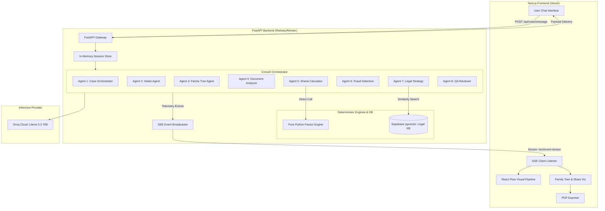
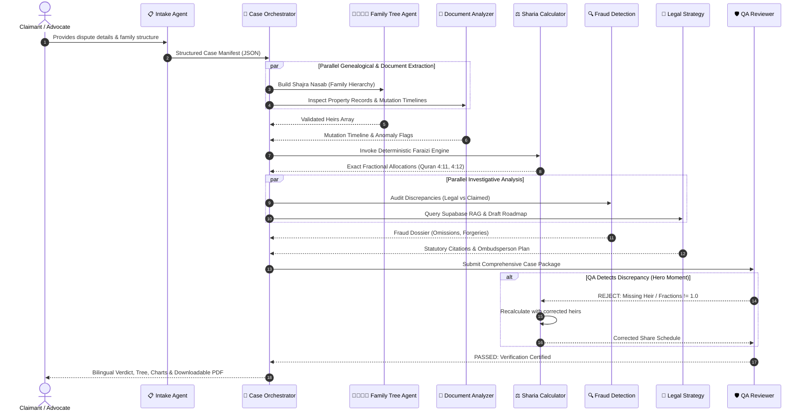

# HaqDar (حقدار) — System Specification (SPEC.md)

**Status:** FINALIZED  
**Project:** HaqDar — AI-Powered Women's Inheritance Rights Recovery Platform  
**Scope:** Full Working MVP for HEC × PakAngels Generative & Agentic AI Hackathon  
**Target Deadline:** 1.5 Days (36 Hours)  
**Author:** Senior Technical Architect & Legal-Tech Systems Engineering Team  

---

## 1. Executive Summary & Problem Context

### 1.1 The Systemic Crisis
In Pakistan, **over 97% of women never receive their lawful landed inheritance**, resulting in a female land ownership rate of approximately **2%** nationwide. This occurs despite explicit constitutional guarantees (Article 23, Article 25) and immutable Islamic Sharia injunctions (Surah An-Nisa 4:11, 4:12, 4:176).

The systemic dispossession follows a standard administrative playbook:
1. **Patriarchal Death:** The father or husband dies owning real estate or agricultural land.
2. **Revenue Collusion:** Male relatives collude with the local **Patwari** (village land revenue clerk).
3. **Record Tampering:** Female heirs are omitted from the handwritten family tree (*Shajra Nasab*) or mutation register (*Intiqal*).
4. **Fraudulent Disclaimers:** Forged oral gift deeds (*Hiba*) or relinquishment affidavits (*Dastbardari / Tamleek*) are recorded claiming women "surrendered" their shares voluntarily.
5. **Civil Litigation Paralysis:** Aggrieved women are forced into civil court suits that endure for **15 to 30 years**, exhausting their financial means.

### 1.2 The Technological Solution: HaqDar
**HaqDar** is an autonomous multi-agent platform orchestrating **8 specialized AI agents** that automates the entire investigation, genealogical reconstruction, deterministic Islamic inheritance calculation, fraud detection, and administrative recovery roadmap in **under 3 minutes**. 

Instead of decades in court, a claimant engages in an empathetic conversational intake, after which the agents systematically analyze the case, mathematically verify Quranic rights, expose fraud patterns, and generate an actionable legal complaint for the **Provincial Ombudsperson under the Enforcement of Women's Property Rights Act 2020** (which mandates case resolution within 60 days).

```
+----------------------------------------------------------------------------------------------------+
|                                    HAQDAR SYSTEM TOPOLOGY                                          |
+----------------------------------------------------------------------------------------------------+
|                                                                                                    |
|    +-------------------+       HTTP / SSE        +--------------------------------------------+    |
|    | Next.js Frontend  | <=====================> |              FastAPI Backend               |    |
|    | (React 18 / Flow) |                         |               (Python 3.11)                |    |
|    +---------+---------+                         +---------------------+----------------------+    |
|              |                                                         |                           |
|              | State Updates                                           | Orchestration             |
|              v                                                         v                           |
|    +-------------------+                         +--------------------------------------------+    |
|    | Pipeline Sidebar  |                         |               CrewAI Engine                |    |
|    | (8 Agent Nodes)   |                         |  - Supervisor Pipeline                     |    |
|    +-------------------+                         |  - Memory-augmented Execution             |    |
|                                                  +----------+--------------------+------------+    |
|                                                             |                    |                 |
|                                           Tool Calls        |                    | RAG Queries     |
|                                                             v                    v                 |
|                                                  +--------------------+ +--------------------+     |
|                                                  | Deterministic      | | Supabase pgvector  |     |
|                                                  | Faraizi Calculator | | (Pakistani Law &   |     |
|                                                  | (Pure Python Math) | | Case Precedents)   |     |
|                                                  +--------------------+ +--------------------+     |
|                                                             |                                      |
|                                                             +--------------+                       |
|                                                                            v                       |
|                                                                 +--------------------+             |
|                                                                 | Groq Llama 3.3 70B |             |
|                                                                 | (LLM Inference)    |             |
|                                                                 +--------------------+             |
+----------------------------------------------------------------------------------------------------+
```

---

## 2. Requirements & Scope Boundaries

### 2.1 Core MVP Features (In-Scope)
1. **Conversational Intake Interface:** An empathetic chat interface where the Intake Agent guides the user through questions regarding deceased relations, property details, and family structure.
2. **Real-Time Visual Pipeline Sidebar:** Powered by **React Flow**, displaying the active execution status, animated data-flow edges, and telemetry of all 8 agents via Server-Sent Events (SSE).
3. **8 Autonomous AI Agents:** Orchestrated using **CrewAI**, covering the complete lifecycle from intake to genealogical reconstruction, fraud detection, legal synthesis, and QA review.
4. **Deterministic Sharia Faraizi Calculator:** Hard-coded pure Python algorithmic engine executing Quranic inheritance mathematics (`fractions.Fraction`) with zero LLM mathematical hallucinations.
5. **Interactive Family Tree Visualization:** Dynamic genealogical diagram visually distinguishing deceased patriarch, rightful heirs, dispossessed female claimants, and excluded parties.
6. **Discrepancy & Fraud Detection Engine:** Algorithmic comparison between legal Sharia distribution versus claimed/mutated distribution, highlighting stolen shares and fraudulent *Hiba* transfers.
7. **Agentic Legal Strategy with RAG:** Retrieval-Augmented Generation queried against **Supabase pgvector** containing Pakistani statutes (*Enforcement of Women's Property Rights Act 2020*, *PPC Section 498A*, *Land Revenue Act 1967*) and Supreme Court precedent.
8. **QA Reviewer with Self-Correction Reflection Loop:** An adversarial reviewer agent that audits fractional totals, catches omitted heirs (e.g. surviving mother or daughters), and programmatically rejects flawed results back to the pipeline before finalization.
9. **Bilingual Output Engine:** User-selectable toggles between formal English and accessible **Roman Urdu** for the final case verdict and recovery plan.
10. **Client-Ready PDF Export:** Instant downloadable legal dossier including case summary, family tree manifest, fraud analysis, and pre-formatted Ombudsperson petition.
11. **Light Professional Design Aesthetic:** High-credibility legal-tech UI utilizing clean slate/emerald/gold styling, crisp contrast, and zero distraction.
12. **Stateless Ephemeral Session Architecture:** Zero mandatory user authentication and zero long-term database persistence for rapid hackathon execution.

### 2.2 Out-of-Scope (Non-Requirements)
- **Document OCR / Vision Upload:** User inputs document details via structured narrative or preset mock buttons. Raw PDF OCR is deferred.
- **Nastaliq Arabic-script Urdu:** UI and reports support English and Roman Urdu to eliminate complex Nastaliq font-rendering failures during hackathon evaluation.
- **User Authentication / Accounts:** No login, OAuth, or user registration. Cases exist in ephemeral in-memory sessions.
- **Persistent Database Storage for Case History:** All generated reports are exported as PDF; no multi-session persistence.
- **Audio Voice Transcription (Whisper STT/TTS):** User communicates via text-based conversational chat.
- **Native Mobile Apps:** Web-only responsive design targeting desktop presentation and modern mobile web viewports.

---

## 3. System Architecture & Component Design

### 3.1 Tech Stack
- **Frontend Framework:** Next.js 14/15 (App Router, React 18/19, TypeScript)
- **Styling & UI:** Tailwind CSS, Lucide React, Shadcn-style light components
- **Workflow Visualization:** React Flow (`@xyflow/react`)
- **Backend API:** FastAPI (Python 3.11+, Pydantic v2, Uvicorn)
- **Agent Orchestration:** CrewAI (Task, Agent, Crew, Process)
- **Inference LLM:** Groq API (`llama-3.3-70b-versatile` / `llama-3.1-70b-versatile`)
- **Vector Database & Embeddings:** Supabase PostgreSQL with `pgvector` extension; embedding generation via lightweight local transformer or OpenAI/Groq compatible embedding endpoints.
- **Real-Time Transport:** Server-Sent Events (SSE) via `StreamingResponse`.
- **Export Engine:** Client-side HTML-to-PDF (`html2pdf.js` / `@react-pdf/renderer` / Tailwind Print Stylesheet).

### 3.2 High-Level Architecture Diagram



---

## 4. Multi-Agent Pipeline Specification (The 8 Agents)

The system employs 8 specialized autonomous agents orchestrated through CrewAI with structured telemetry emissions at every state change.



### 4.1 Agent Roles and Specifications

#### Agent 1: 🎯 Case Orchestrator
- **Pattern:** Supervisor + Router
- **Role:** Central case supervisor and stage coordinator.
- **Goal:** Direct workflow transitions between agents, monitor execution health, route case classification (Urban Real Estate vs. Rural Agricultural Land), and govern data aggregation.
- **Input:** Case initiation trigger or completed outputs from pipeline stages.
- **Output:** Orchestration telemetry events, structured pipeline phase changes.

#### Agent 2: 📋 Intake Agent
- **Pattern:** Sequential Conversational Pipeline
- **Role:** Empathetic interviewer and structured entity extractor.
- **Goal:** Conduct conversational multi-turn or single-shot interviews with the claimant, extracting: deceased name, date of death, surviving relatives, property descriptions, and the claimed distribution.
- **Input:** User conversational messages.
- **Output:** `CaseIntakeData` schema containing validated genealogical entities and property claims.

#### Agent 3: 👨‍👩‍👧‍👦 Family Tree Agent
- **Pattern:** Tool-Use (ReAct) + Tree Synthesizer
- **Role:** Genealogical reconstruction officer.
- **Goal:** Transform raw family relations into a strict hierarchical *Shajra Nasab* (genealogical tree), categorizing each relative by relation, gender, vital status, and legal entitlement class.
- **Input:** Heirs list from Intake Agent.
- **Output:** `FamilyTreeGraph` schema (nodes and edges ready for visualization) and categorized legal heirs array.

#### Agent 4: 📄 Document Analyzer
- **Pattern:** Parallel Execution (Fan-Out with Family Tree)
- **Role:** Forensic registry and mutation inspector.
- **Goal:** Cross-examine declared mutation details (*Intiqal*), gift deeds (*Hiba*), and relinquishment deeds (*Dastbardari*). Flags red flags such as *Hiba* executed days prior to death, un-notarized oral gifts, or transfers bypassing female heirs.
- **Input:** Property transaction narrative and dates.
- **Output:** `DocumentForensicReport` with anomaly tags and risk scoring.

#### Agent 5: ⚖️ Sharia Inheritance Calculator
- **Pattern:** Deterministic Tool-Caller (Zero Hallucination)
- **Role:** Islamic Faraizi Jurisprudence Engine.
- **Goal:** Calculate the exact Quranic fractional shares for all surviving heirs by directly executing the hard-coded Python Faraizi engine. **Never uses LLM arithmetic.**
- **Input:** Categorized legal heirs array and estate valuation.
- **Output:** `FaraiziDistribution` (shares as exact fractions, percentages, and financial values).

#### Agent 6: 🔍 Fraud Detection Agent
- **Pattern:** Adversarial Auditor / Debate Pattern
- **Role:** Investigative auditor comparing de facto vs. de jure distributions.
- **Goal:** Compare the legal Sharia distribution against the actual claimed/mutated distribution. Highlights stolen percentages, identifies which male heirs expropriated female shares, and identifies legal violations under Pakistan Penal Code.
- **Input:** `FaraiziDistribution` + `DocumentForensicReport` + Claimed distribution.
- **Output:** `FraudAuditDossier` detailing specific stolen amounts and fraudulent instruments.

#### Agent 7: 📜 Legal Strategy Agent
- **Pattern:** Planning Agent + Agentic RAG
- **Role:** Senior High Court legal strategist.
- **Goal:** Formulate a prioritized recovery roadmap utilizing Pakistani legislation, prioritizing the **Enforcement of Women's Property Rights Act 2020** through the Provincial Ombudsperson (statutory 60-day resolution timeline) over protracted civil court litigation.
- **Input:** `FraudAuditDossier` + Vector query results from Supabase pgvector.
- **Output:** `LegalRoadmap` featuring step-by-step procedures, jurisdiction, draft petition headers, and statutory citations.

#### Agent 8: 🛡️ QA Reviewer (Reflection Agent)
- **Pattern:** Reflection & Self-Correction Loop
- **Role:** Final quality gate and judicial auditor.
- **Goal:** Inspect the entire output for mathematical invariance ($\sum shares = 1.0$), verify that no living heir has been bypassed, audit statutory citations, and trigger automatic recalculation if discrepancies are found.
- **Input:** Complete consolidated case package.
- **Output:** `QAVerdict` (Approval or Rejection with corrective feedback payload).

---

## 5. Deterministic Sharia Faraizi Engine Specification

The Faraizi calculation engine is implemented in pure Python (`faraizi_engine.py`) using `fractions.Fraction`. LLMs are strictly forbidden from performing arithmetic calculations.

### 5.1 Jurisprudential Rules (Hanafi / Pakistani Statutory Baseline)

```
====================================================================================================
                                 ISLAMIC FARAIZI ALLOCATION LOGIC
====================================================================================================

Estate Net Assets = Total Assets - Debts - Funeral Expenses - Valid Wills (Max 1/3)

1. PRIMARY QUR'ANIC SHARERS (Zawil-Furood):
   -------------------------------------------------------------------------------------------------
   Heir                  Condition                                         Share
   -------------------------------------------------------------------------------------------------
   Wife                  With surviving children or son's children         1/8 (shared equally if >1)
                         Without children                                  1/4 (shared equally if >1)
   Husband               With children                                     1/4
                         Without children                                  1/2
   Mother                With children or multiple siblings                1/6
                         Without children and <= 1 sibling                 1/3
   Father                With children (sons present)                      1/6 (Qur'anic sharer)
                         With daughters only                               1/6 + Residuary
                         Without children                                  Residuary (Asabah)
   Daughter(s)           Single daughter (no sons)                         1/2
                         Two or more daughters (no sons)                   2/3 (shared equally)
                         With son(s)                                       Residuary (Brother gets 2x)
   -------------------------------------------------------------------------------------------------

2. RESIDUARIES (Asabah):
   - Offspring: Sons and Daughters distribute remaining estate where 1 Male Share = 2 Female Shares.
   - Equation:
       Remaining Fraction = 1 - (Sum of Qur'anic Sharers)
       Weight_Total = (2 * Num_Sons) + (1 * Num_Daughters)
       Single_Daughter_Share = Remaining Fraction / Weight_Total
       Single_Son_Share = 2 * Single_Daughter_Share

3. ADJUSTMENT MECHANISMS:
   - Awl (Proportional Reduction): If Sum of Shares > 1, expand common denominator so all sharers 
     absorb equitable fractional dilution.
   - Radd (Return): If Sum of Shares < 1 and no residuary heirs exist, return surplus to Qur'anic 
     sharers proportionally (excluding spouse under traditional Hanafi rule, or including spouse under 
     Pakistani legal precedent where no other kin exist).
   - Hajb (Total Exclusion):
     * Living Son excludes Grandchildren (Son's sons/daughters).
     * Living Father excludes Paternal Grandfather.
     * Living Mother excludes Grandmothers.
     * Living Children/Father exclude Full/Half Brothers and Sisters.
====================================================================================================
```

### 5.2 Mathematical Engine Verification Test Matrix

```python
# Reference Test Case: Standard Patriarchal Dispossession Case
# Deceased: Father
# Surviving: 1 Wife, 1 Mother, 2 Sons, 1 Daughter (Claimant)
# Estate: 10,000,000 PKR (or 100 Kanals)

# Calculation:
# 1. Qur'anic Sharers:
#    - Wife: 1/8 = 12.5%
#    - Mother: 1/6 = 16.6667%
#    - Sum of Sharers = 1/8 + 1/6 = 7/24 (29.1667%)
# 2. Residuary Pool = 1 - 7/24 = 17/24 (70.8333%)
# 3. Offspring Distribution:
#    - 2 Sons (weight: 2 * 2 = 4)
#    - 1 Daughter (weight: 1 * 1 = 1)
#    - Total Weight = 5
#    - Daughter Share = (17/24) * (1/5) = 17/120 = 14.1667%
#    - Each Son Share = (17/24) * (2/5) = 34/120 = 17/60 = 28.3333%
# 4. Total Sum Check:
#    - 15/120 (Wife) + 20/120 (Mother) + 34/120 (Son 1) + 34/120 (Son 2) + 17/120 (Daughter)
#    - Sum = 120/120 = 1.0000 (Exact 100%)
```

---

## 6. Real-Time Telemetry & SSE Streaming Protocol

### 6.1 Server-Sent Events (SSE) Channel
FastAPI exposes an asynchronous SSE stream at `/api/case/stream/{case_id}`. As the CrewAI pipeline progresses, events are dispatched through an in-memory broadcast bus.

### 6.2 Telemetry Event Schema

```json
{
  "event": "agent_state_update",
  "data": {
    "case_id": "case-948271",
    "agent_id": "sharia_calculator",
    "agent_name": "Sharia Inheritance Calculator",
    "status": "running | completed | error | self_correcting",
    "summary": "Calculating Quranic fractional allocations via Faraizi engine...",
    "progress_percent": 62,
    "payload": {
      "step": "fraction_computed",
      "shares": [
        {"heir": "Wife (Naseem)", "fraction": "1/8", "percentage": 12.5},
        {"heir": "Daughter (Fatima - Claimant)", "fraction": "17/120", "percentage": 14.17}
      ]
    },
    "timestamp": "2026-10-02T12:00:00Z"
  }
}
```

### 6.3 React Flow Visual State Synchronization
The frontend maintains an interactive Directed Acyclic Graph (DAG) using React Flow. Each node corresponds to one of the 8 agents:
- **Idle / Pending:** Neutral slate border, muted text.
- **Running:** Emerald pulsing halo, active spinner, glowing output edges.
- **Completed:** Solid emerald border, checkmark icon, summary tooltip.
- **Self-Correcting (Hero Moment):** Amber/Rose pulsing halo with animated backward feedback loop to the targeted subagent node.

---

## 7. Vector Database & Legal RAG Specification

### 7.1 Supabase pgvector Architecture
A dedicated PostgreSQL table `legal_precedents` with `pgvector` indexing stores relevant Pakistani statutory sections and High Court/Supreme Court rulings.

```sql
-- Supabase Vector Table Definition
create extension if not exists vector;

create table legal_knowledge_base (
    id uuid primary key default gen_random_uuid(),
    title text not null,
    citation text not null,
    jurisdiction text not null default 'Pakistan',
    category text not null, -- 'statute', 'supreme_court', 'ombudsperson_rule'
    content text not null,
    embedding vector(384) -- 384-dim for MiniLM / standard lightweight embeddings
);

create index on legal_knowledge_base using ivfflat (embedding vector_cosine_ops)
with (lists = 20);
```

### 7.2 Seed Corpus Components
1. **Enforcement of Women's Property Rights Act 2020 (Federal & Punjab Act 2021):**
   - Section 4: Powers of the Ombudsperson to investigate complaints.
   - Section 5: Procedure for calling revenue records from the Deputy Commissioner.
   - Section 7: 60-day statutory resolution timeline and police enforcement mandates.
2. **Pakistan Penal Code (PPC) 1860:**
   - Section 498A: Prohibition of depriving women from inheriting property (Punishable by up to 10 years imprisonment and 1 million PKR fine).
3. **West Pakistan Land Revenue Act 1967:**
   - Section 42: Procedure for reporting acquisition of rights and mutation entry (*Intiqal*).
4. **Supreme Court Precedents:**
   - *Ghulam Murtaza v. Mst. Ashiq Noor (PLD 2020 SC 527):* Nullification of fraudulent oral gift (*Hiba*) executed near death to dispossess female heirs.
   - *Mst. Sughran Bibi v. Mst. Hajira Bibi (2021 SCMR 1032):* Heavy burden of proof on male beneficiaries claiming voluntary relinquishment (*Dastbardari*).

---

## 8. API Specification

### 8.1 API Endpoints Summary

| Method | Endpoint | Description | Request Body | Response |
|---|---|---|---|---|
| `POST` | `/api/case/start` | Initialize a new ephemeral case session | `{ "locale": "en" \| "ur_roman" }` | `{ "case_id": "string", "session_token": "string" }` |
| `POST` | `/api/case/message` | Submit conversational message to Intake Agent | `{ "case_id": "string", "message": "string" }` | `{ "reply": "string", "pipeline_started": boolean }` |
| `GET` | `/api/case/stream/{caseId}` | SSE channel streaming agent states & telemetry | None | `text/event-stream` |
| `POST` | `/api/case/calculate` | Standalone deterministic Faraizi calculation | `{ "family": HeirInput[], "estate_value": number }` | `FaraiziDistribution` |
| `GET` | `/api/case/{caseId}/report` | Retrieve completed consolidated case report | None | `ComprehensiveCaseReport` |
| `POST` | `/api/case/{caseId}/pdf` | Generate printable legal dossier & petition | `{ "language": "en" \| "ur_roman" }` | PDF Binary Stream |

### 8.2 JSON Data Contracts

#### Case Intake & Family Schema
```typescript
interface HeirInput {
  name: string;
  relation: "wife" | "husband" | "mother" | "father" | "son" | "daughter" | "brother" | "sister";
  gender: "male" | "female";
  isAlive: boolean;
  isClaimant?: boolean;
  actualClaimedPercentage?: number; // Claimed percentage reported by patwari/family
}

interface CaseState {
  caseId: string;
  deceasedName: string;
  dateOfDeath: string;
  propertyDescription: string;
  propertyEstimatedValuePkr: number;
  heirs: HeirInput[];
  allegedFraudType: "omitted_heir" | "fake_hiba" | "forced_relinquishment" | "patwari_tampering";
  pipelineStatus: "idle" | "intake" | "analyzing" | "qa_review" | "completed" | "failed";
}
```

#### Final Report Schema
```typescript
interface ComprehensiveCaseReport {
  caseId: string;
  claimantName: string;
  deceasedName: string;
  familyTree: {
    nodes: Array<{ id: string; label: string; role: string; sharePercentage: number; status: string }>;
    edges: Array<{ from: string; to: string; label: string }>;
  };
  distribution: {
    totalEstateValuePkr: number;
    shares: Array<{
      heirName: string;
      relation: string;
      quranicShareFraction: string;
      entitledPercentage: number;
      entitledValuePkr: number;
      actualClaimedPercentage: number;
      discrepancyPercentage: number;
    }>;
  };
  fraudFindings: {
    fraudDetected: boolean;
    fraudType: string;
    totalStolenValuePkr: number;
    flaggedDocuments: Array<{ name: string; anomaly: string; riskLevel: "HIGH" | "CRITICAL" }>;
    violatingStatutes: string[];
  };
  legalStrategy: {
    primaryForum: "Provincial Ombudsperson (Women's Property Rights Act 2020)" | "Civil Court" | "Revenue Officer";
    statutoryFilingTimeline: "60 Days Mandatory Resolution";
    stepByStepActions: Array<{ step: number; title: string; description: string }>;
    precedentCitations: Array<{ citation: string; ruleOfLaw: string }>;
  };
  qaAudit: {
    verifiedBy: "QA Reviewer Agent";
    mathVerified: boolean;
    omissionsChecked: boolean;
    selfCorrectionTriggered: boolean;
    notes: string;
  };
}
```

---

## 9. User Interface & Experience Design

### 9.1 Visual Theme: Legal-Tech Light
- **Backgrounds:** Clean crisp Slate-50 (`#F8FAFC`) and Pure White (`#FFFFFF`).
- **Primary Justice Accents:** Deep Emerald (`#059669` / `#047857`) representing institutional legitimacy, equity, and Islamic ethics.
- **Inheritance Accents:** Muted Gold / Amber (`#D97706` / `#B45309`) representing property valuation and Sharia precision.
- **Alert & Fraud Accents:** Crimson Red (`#DC2626` / `#EF4444`) highlighting fraudulent dispossessions and missing heirs.
- **Typography:** Inter or Geist Sans for ultra-legible data displays, tabular numerals for mathematical share comparison tables.

### 9.2 Dashboard Layout
The interface is designed as an interactive single-window command center:
1. **Left Column / Sidebar (30% width):** Visual Agent Pipeline graph (React Flow) rendering the 8 agent nodes, live status pills, and real-time step streaming.
2. **Center / Main Panel (70% width):**
   - **Phase 1 (Intake):** Conversational chat interface with intelligent smart chips for quick case scenarios (e.g. *"Father died in Faisalabad, 2 brothers took 80 Kanals via fake Hiba"*).
   - **Phase 2 (Investigation):** Dynamically transitions into the interactive Dossier View upon pipeline trigger:
     - **Interactive Family Tree:** Visual D3/SVG node hierarchy highlighting claimant in gold and dispossessed sisters in red.
     - **Inheritance Share Breakdown Table:** Side-by-side comparison of **Legal Quranic Share vs. De Facto Allocation**.
     - **Fraud Alert Cards:** Critical badges detailing forgery risks and omitted names.
     - **Legal Recovery Roadmap:** Interactive timeline guiding the user on lodging complaints before the Ombudsperson.
   - **Header Controls:** Language Toggle (`English` | `Roman Urdu`) and `Download Official Legal Dossier (PDF)` action button.

---

## 10. The "Hero Moment" (Demonstrating Genuine AI Agency)

To decisively prove autonomous agency and reflection to hackathon evaluators, HaqDar embeds an observable **Self-Correction Loop**:

1. **The Intentional Discrepancy:** During pipeline processing of a sample case, the initial genealogical parse creates a distribution where the deceased's mother is inadvertently bypassed or marked as non-inheriting.
2. **The QA Agent Intervention:** The **QA Reviewer Agent** audits the proposed calculation against Islamic jurisprudence rules (Quran 4:11: *"And to his parents, to each one of them is a sixth of what he left if he has children"*).
3. **The Event Dispatch:** The QA Agent emits a `REJECTION_REVISION` telemetry event:
   ```
   🛡️ QA Reviewer: "REJECTED — Share calculation omits the deceased's surviving mother. 
   Under Quran 4:11, the mother must receive 1/6 when offspring survive. 
   Rejecting draft and routing back to Sharia Calculator for recalculation..."
   ```
4. **Visual UI Reflection:** On the React Flow diagram, the QA node flashes amber, and an animated feedback edge routes backwards to the Sharia Calculator node.
5. **Auto-Correction:** The Sharia Calculator re-runs with the complete heir schedule, the fractions update dynamically on screen to sum to exactly 1.0, and the QA Reviewer certifies the finalized dossier with a green badge.

---

## 11. Security, Performance & Constraints

### 11.1 Groq API Rate Limit Optimization
- Groq free tier provides 30 requests per minute and 6,000 tokens per minute.
- **Architectural Safeguards:**
  - Hard-coded Python Faraizi engine consumes zero LLM tokens.
  - Standardized JSON prompt templates enforce compact, bounded context windows.
  - Agent instructions are condensed to minimize system prompt token overhead.

### 11.2 Ephemeral Session Model
- In-memory thread store utilizing Python `uuid4` keys with an automatic TTL of 60 minutes.
- No PII is persisted to public cloud disks, preserving sensitive claimant privacy during live demonstrations.
