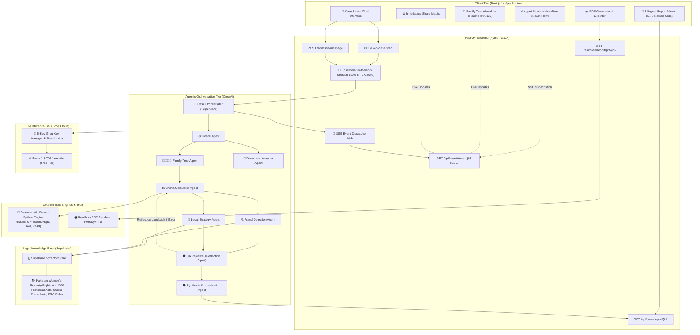
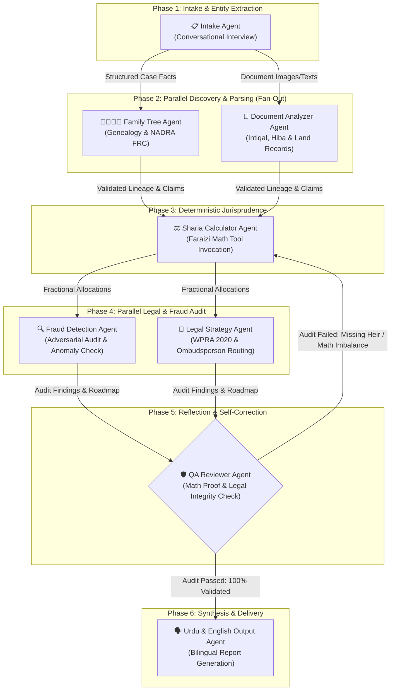
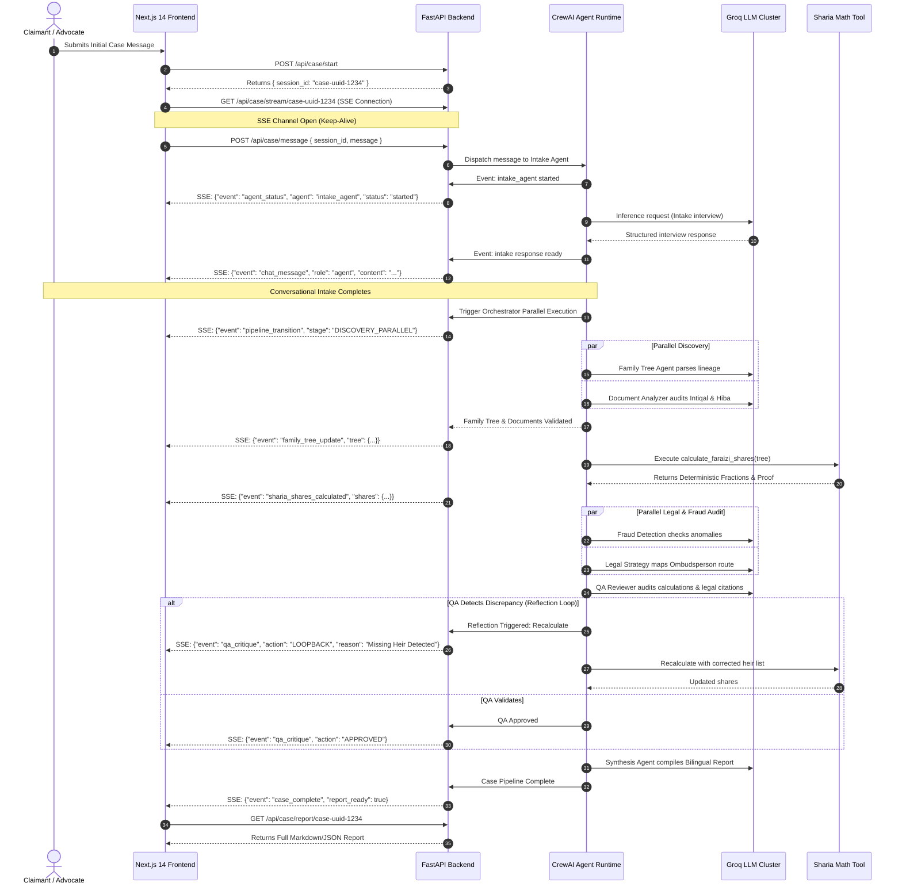
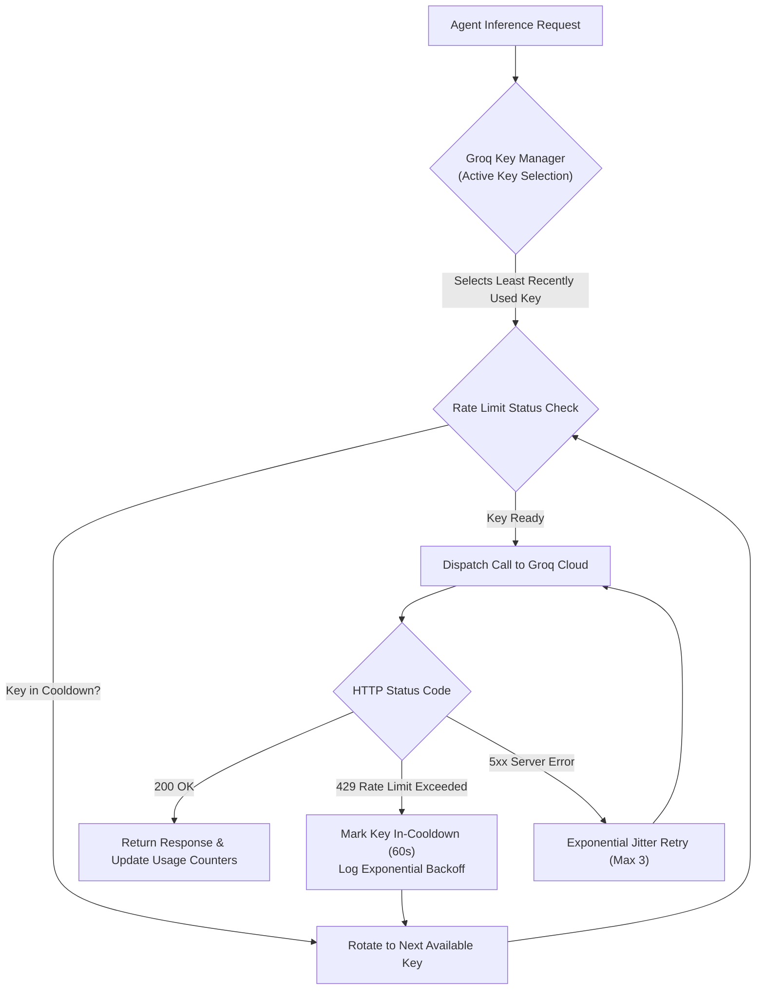
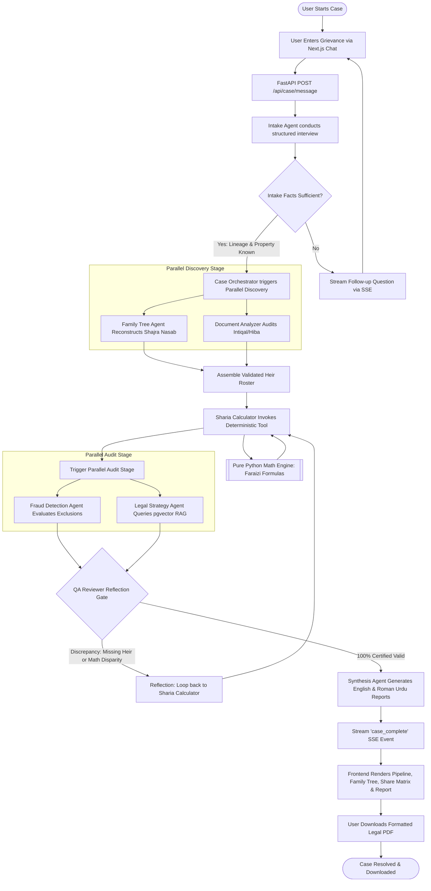
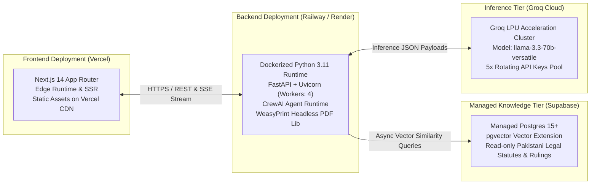

# HaqDar (حقدار) — Technical Architecture Document

> **System Architecture & Technical Design Document (TDD)**  
> **Platform:** AI-Powered Women's Inheritance Rights Recovery Platform  
> **Target Event:** HEC × PakAngels Generative & Agentic AI Hackathon  
> **Status:** Production Architecture Blueprint  
> **Version:** 1.0.0  

---

## 1. Executive Summary & Architectural Tenets

**HaqDar** is an autonomous multi-agent legal intelligence platform designed to dismantle the systemic disenfranchisement of women from their lawful landed inheritance in Pakistan. In an environment where 97% of women are denied inheritance and civil courts average 15–30 years of litigious paralysis, HaqDar provides a rapid, mathematically proven, and legally actionable recovery pathway within minutes.

### 1.1 Core Architectural Tenets

1. **Deterministic Mathematical Correctness (Zero Math Hallucination):**  
   Inheritance shares governed by Islamic Faraizi jurisprudence (Quran 4:11, 4:12, 4:176) are strictly deterministic. Calculations are delegated to an algorithmic Python engine utilizing exact rational arithmetic (`fractions.Fraction`), never generative LLM guessing.
2. **Autonomous Multi-Agent Choreography:**  
   Built upon **CrewAI**, the system employs 8 specialized autonomous agents orchestrated across sequential, parallel (fan-out), adversarial, and reflective (self-correcting) workflow topologies.
3. **Low-Latency Streaming Telemetry:**  
   Server-Sent Events (SSE) stream agent lifecycle events, thought traces, execution metrics, and intermediate artifacts in real time to an interactive Next.js 14 reactive dashboard.
4. **Zero-PII Ephemeral State:**  
   To preserve the absolute safety and privacy of vulnerable female claimants in disputed family dynamics, case sessions do not persist in long-term databases. All case state is stored strictly in ephemeral, TTL-bound memory.
5. **High-Resilience LLM Free-Tier Operation:**  
   To operate reliably within Groq's high-throughput free-tier rate limits (`llama-3.3-70b-versatile`), the backend integrates an intelligent 5-key round-robin rotation pool with adaptive backoff and rate-limit circuit-breaking.

---

## 2. High-Level System Architecture

The HaqDar architecture is decoupled into a high-performance presentation tier (Next.js 14 App Router), an asynchronous agentic orchestration backend (FastAPI + CrewAI), a vector retrieval engine (Supabase pgvector), and an LLM inference acceleration cluster (Groq Cloud).



---

## 3. Component Architecture & Subsystems

```mermaid
flowchart LR
    subgraph FrontendComponents["Next.js Frontend Architecture"]
        direction TB
        subgraph AppLayout["App Router (/app)"]
            PageLayout["layout.tsx"]
            CasePage["page.tsx"]
        end
        subgraph UIState["Client State & Hooks"]
            CaseContext["useCaseState (Zustand / Context)"]
            SSEHook["useAgentStream (EventSource Hook)"]
        end
        subgraph VisualComponents["Presentation Components"]
            ChatComp["CaseChat.tsx"]
            FlowComp["AgentPipelineFlow.tsx (React Flow)"]
            TreeComp["FamilyTreeGraph.tsx"]
            ShareComp["ShareBreakdownTable.tsx"]
            ReportComp["ReportViewer.tsx (EN / Roman Urdu)"]
        end
    end

    subgraph BackendComponents["FastAPI Backend Architecture"]
        direction TB
        subgraph Routes["API Routers"]
            CaseRouter["/routes/case.py"]
            StreamRouter["/routes/stream.py"]
            ReportRouter["/routes/report.py"]
        end
        subgraph CoreServices["Core Services"]
            SessionService["session_store.py (In-Memory)"]
            CrewService["crew_runner.py (CrewAI Coordinator)"]
            EventBroadcaster["event_broadcaster.py (SSE Queue)"]
            GroqPoolService["groq_pool.py (Key Rotation)"]
            ShariaService["sharia_engine.py (Pure Math)"]
            VectorService["rag_service.py (Supabase Client)"]
            PDFService["pdf_service.py (HTML to PDF)"]
        end
    end

    AppLayout --> UIState
    UIState --> VisualComponents
    VisualComponents <--> Routes
    Routes --> CoreServices
```



### 3.1 Frontend Subsystem (Next.js 14 App Router)

- **Chat Interface (`/components/chat/CaseChat.tsx`):**
  - Handles conversational intake interactions with the `IntakeAgent`.
  - Supports Markdown rendering, quick suggested responses, and dynamic form inputs (e.g., heir counts, dates).
- **Pipeline Visualizer (`/components/visualizer/AgentPipelineFlow.tsx`):**
  - Powered by **React Flow**.
  - Renders the active multi-agent pipeline topology.
  - Dynamically transitions node states: `idle` (gray), `thinking` (amber pulse), `tool_call` (blue), `completed` (green), `reflecting` (purple retry pulse), `error` (red).
- **Family Tree Visualizer (`/components/visualizer/FamilyTreeGraph.tsx`):**
  - Hierarchical family tree rendering (Deceased Patriarch/Matriarch at root, spouses, sons, daughters, siblings).
  - Graph nodes highlight heir status, Quranic share fraction, and flagged fraudulent omission status.
- **Inheritance Share Display (`/components/reports/ShareBreakdownTable.tsx`):**
  - Tabulates heirs, relationship, legal category (*Sharer/Zawil-Furooz* vs. *Residuary/Asabah*), fractional formula, percentage share, and estimated property acreage/value.
- **Bilingual Report Viewer (`/components/reports/ReportViewer.tsx`):**
  - Toggle between English and Roman Urdu.
  - Formatted sections: Executive Findings, Family Genealogy Analysis, Sharia Math Breakdown, Fraud Alerts, Step-by-Step Legal Recovery Action Plan citing Pakistani Law.
- **PDF Download Integration:**
  - One-click trigger requesting binary PDF streaming from backend with branded typography and stamp.

### 3.2 Backend Subsystem (FastAPI + Python 3.11+)

- **Session Management (`app/services/session_store.py`):**
  - Thread-safe in-memory session registry with a 60-minute TTL.
  - Stores session parameters, conversation history, extracted family entities, Sharia shares, and agent thought logs.
- **SSE Event Hub (`app/services/event_broadcaster.py`):**
  - Async queue (`asyncio.Queue`) per session.
  - Emits formatted `text/event-stream` updates on agent state transitions, intermediate thoughts, and final payloads.
- **CrewAI Runner Service (`app/services/crew_runner.py`):**
  - Instantiates and executes CrewAI agents and tasks asynchronously in background threads/tasks without blocking FastAPI's event loop.
- **Deterministic Sharia Engine (`app/services/sharia_engine.py`):**
  - Implements authentic Sunni Hanafi inheritance jurisprudence rules using `fractions.Fraction`.
- **Groq API Key Pool (`app/services/groq_pool.py`):**
  - Rotates between 5 distinct Groq API keys, monitors remaining rate-limit quotas, and dynamically pauses exhausted keys.
- **Vector RAG Service (`app/services/rag_service.py`):**
  - Connects to Supabase pgvector using the Supabase Python SDK and Postgres `pgvector` extension to run hybrid semantic search against Pakistani legal acts and precedents.

---

## 4. Multi-Agent Layer Architecture (CrewAI)

The multi-agent system uses **CrewAI** to enforce task dependencies, role constraints, and validation checkpoints.



### 4.1 Detailed Agent Specifications

#### 1. Intake Agent (`intake_agent`)
- **Role:** Compassionate Legal Intake Specialist
- **Goal:** Conduct an empathetic, structured interview to collect deceased particulars, date of death, known family members, property locations, and the nature of the dispute.
- **Backstory:** A seasoned paralegal at the Legal Aid Society in Lahore, specialized in helping rural and urban women articulate inheritance grievances without intimidation.
- **Tools:** `extract_case_entities`, `validate_cnic_format`
- **Output:** Structured `CaseIntakeData` JSON schema.

#### 2. Family Tree Agent (`family_tree_agent`)
- **Role:** Forensic Genealogist & NADRA Verification Expert
- **Goal:** Reconstruct the complete genealogical family tree (*Shajra Nasab*) of the deceased, identifying all legal heirs under Islamic law, including deliberately obscured female relatives.
- **Backstory:** An expert in Pakistani civil documentation, Family Registration Certificates (FRC), and rural Patwari genealogical trees with 15 years uncovering hidden lineage records.
- **Tools:** `build_genealogy_graph`, `check_omitted_female_relatives`
- **Output:** Hierarchical `FamilyTree` JSON structure containing parentage, status, and alive/deceased dates.

#### 3. Document Analyzer Agent (`document_analyzer_agent`)
- **Role:** Revenue & Land Records Forensic Examiner
- **Goal:** Ingest and parse land ownership registry extracts (*Fard*), mutation certificates (*Intiqal*), and gift deeds (*Hiba* or *Tamleek*), identifying forged signatures, lack of independent legal counsel for women, and suspicious deathbed gifts (*Marz-ul-Maut*).
- **Backstory:** A former Punjab Land Records Authority (PLRA) chief inspector who knows every method dishonest Patwaris use to falsify mutations.
- **Tools:** `parse_property_fard`, `audit_hiba_gift_deed`, `check_marz_ul_maut`
- **Output:** `DocumentAuditReport` detailing property acreage, mutation dates, and flagged anomalies.

#### 4. Sharia Calculator Agent (`sharia_calculator_agent`)
- **Role:** Islamic Jurisprudence (Faraizi) Inheritance Actuary
- **Goal:** Map the family tree to exact Quranic inheritance fractions strictly using the deterministic Python Faraizi math tool. NEVER compute fractions directly through LLM token prediction.
- **Backstory:** A scholar trained at International Islamic University Islamabad who translates complex Quranic injunctions into deterministic mathematical algorithms.
- **Tools:** `calculate_faraizi_shares` (Custom Python Tool wrapping deterministic engine)
- **Output:** `ShariaDistributionResult` containing exact fractions, percentages, base denominators, and Quranic citations.

#### 5. Fraud Detection Agent (`fraud_detection_agent`)
- **Role:** Adversarial Inheritance Fraud Investigator
- **Goal:** Cross-reference the Sharia distribution against actual mutation records and claimed distributions to identify unlawful dispossession, omitted heirs, forged gifts, and coerced relinquishments.
- **Backstory:** An aggressive anticorruption investigator specialized in uncovering collusion between male relatives and revenue officials under Section 498A of the Pakistan Penal Code.
- **Tools:** `compare_shares_vs_mutation`, `query_fraud_indicators`
- **Output:** `FraudInvestigationSummary` listing fraud indicators, confidence scores, and criminal/civil liability points.

#### 6. Legal Strategy Agent (`legal_strategy_agent`)
- **Role:** High Court Advocate & Women's Property Rights Strategist
- **Goal:** Formulate an actionable, rapid legal recovery roadmap leveraging the *Enforcement of Women's Property Rights Act 2020*, the Provincial Ombudsperson for Protection Against Harassment, and civil injunction pathways.
- **Backstory:** A Supreme Court of Pakistan advocate who pioneered emergency petitions before the Federal and Provincial Ombudspersons, avoiding 20-year civil court delays.
- **Tools:** `query_legal_knowledge_base` (Supabase pgvector), `generate_ombudsperson_petition`
- **Output:** `LegalRoadmap` with step-by-step administrative and judicial actions, filing templates, and precedent citations.

#### 7. QA Reviewer Agent (`qa_reviewer_agent`)
- **Role:** Senior Judicial Reviewer & Self-Correction Gatekeeper
- **Goal:** Audit the entirety of the pipeline output: verify that all inheritance fractions sum to exactly 1.0 (or match valid *Awl* / *Radd* conditions), ensure no female heir was omitted, confirm statutory citations are active, and reject incomplete or flawed analyses.
- **Backstory:** A retired High Court justice known for uncompromising standards of judicial accuracy and adherence to procedural integrity.
- **Tools:** `verify_mathematical_closure`, `validate_statutory_citations`
- **Output:** `QAReviewVerdict` (`status: "APPROVED" | "REVISE"`, `critique_notes: str`, `target_agent: str`).

#### 8. Synthesis & Localization Agent (`output_agent`)
- **Role:** Bilingual Legal Communicator & Advocate
- **Goal:** Synthesize the validated case findings into clear, empathetic, and authoritative reports in both English and accessible Roman Urdu.
- **Backstory:** A bilingual legal journalist skilled at explaining complex legal-religious rights in accessible language to empower non-lawyers.
- **Tools:** `format_bilingual_report`, `generate_claimant_summary`
- **Output:** Dual-language markdown report rendered on the client and sent to the PDF generation engine.

---

## 5. Deterministic Sharia Calculation Engine

### 5.1 Jurisprudential Specification (Sunni Hanafi Faraizi Law)

Under Islamic law, inheritance is calculated sequentially after deducting funeral expenses, debts, and valid bequests (max 1/3 to non-heirs):

1. **Step 1: Identify Primary Quranic Sharers (*Zawil-Furooz*):**
   - **Wife:** 1/8 (if children exist) or 1/4 (if no children).
   - **Husband:** 1/4 (if children exist) or 1/2 (if no children).
   - **Mother:** 1/6 (if children or multiple siblings exist) or 1/3 (if neither).
   - **Father:** 1/6 (if male child exists); or 1/6 + residuary (if only female children); or pure residuary (if no children).
   - **Daughter(s):** 1/2 (single daughter, no sons) or 2/3 shared equally (multiple daughters, no sons). If sons exist, daughters become residuaries (*Asabah bil-Ghayr*).
2. **Step 2: Apply Exclusion (*Hajb* Rules):**
   - Son completely excludes brothers, sisters, nephews, nieces, uncles.
   - Father excludes grandfather and siblings.
   - Mother excludes grandmothers.
3. **Step 3: Distribute to Residuaries (*Asabah*):**
   - Children share remaining estate after primary sharers: each son receives **2 shares** for every **1 share** each daughter receives ($2:1$ ratio, Quran 4:11).
4. **Step 4: Resolve Deficit (*Awl*):**
   - If the sum of fractional shares exceeds $1.0$ (e.g., Husband 1/4 + Two Daughters 2/3 + Mother 1/6 = $3/12 + 8/12 + 2/12 = 13/12$), the base denominator is proportionally increased to the numerator ($13$), scaling down all shares equally.
5. **Step 5: Resolve Surplus (*Radd*):**
   - If the sum of shares is less than $1.0$ and no residuaries exist, the surplus is redistributed proportionally among primary sharers (excluding the spouse under traditional rule, or including spouse under statutory Pakistani judicial reforms).

### 5.2 Deterministic Engine Implementation Architecture

```python
# app/services/sharia_engine.py
from fractions import Fraction
from typing import Dict, List, Any
from pydantic import BaseModel

class HeirInput(BaseModel):
    relation: str  # 'wife', 'husband', 'mother', 'father', 'son', 'daughter', 'brother', 'sister'
    count: int = 1
    alive: bool = True

class HeirShare(BaseModel):
    relation: str
    count: int
    fraction_str: str
    fraction_value: float
    percentage: float
    category: str  # 'Zawil-Furooz' (Sharer) or 'Asabah' (Residuary)
    quranic_basis: str

class ShariaCalculationResult(BaseModel):
    shares: List[HeirShare]
    total_distributed_fraction: str
    awl_applied: bool
    radd_applied: bool
    base_denominator: int
    mathematical_proof: str
```

The mathematical engine processes fractions through exact arithmetic, producing provable fractions (e.g. `1/8`, `1/6`, `17/120`) and eliminating floating-point rounding errors.

---

## 6. Knowledge Base & Agentic RAG Architecture

### 6.1 Supabase pgvector Schema

```sql
-- PostgreSQL / Supabase Schema for Legal Knowledge Base
CREATE EXTENSION IF NOT EXISTS vector;

CREATE TABLE IF NOT EXISTS legal_statutes (
    id UUID PRIMARY KEY DEFAULT gen_random_uuid(),
    title TEXT NOT NULL,
    jurisdiction TEXT NOT NULL, -- 'Federal', 'Punjab', 'Sindh', 'KPK', 'Balochistan'
    act_name TEXT NOT NULL,
    section_number TEXT,
    content TEXT NOT NULL,
    summary TEXT,
    embedding vector(1536), -- Compatible with OpenAI / Groq text embedding
    metadata JSONB DEFAULT '{}'::jsonb,
    created_at TIMESTAMP WITH TIME ZONE DEFAULT NOW()
);

CREATE TABLE IF NOT EXISTS legal_precedents (
    id UUID PRIMARY KEY DEFAULT gen_random_uuid(),
    citation TEXT NOT NULL, -- e.g., 'PLD 2021 SC 812', '2020 CLC 145'
    court TEXT NOT NULL, -- 'Supreme Court', 'Lahore High Court', 'Federal Ombudsperson'
    case_title TEXT NOT NULL,
    year INTEGER NOT NULL,
    ratio_decidendi TEXT NOT NULL,
    key_holding TEXT NOT NULL,
    embedding vector(1536),
    metadata JSONB DEFAULT '{}'::jsonb,
    created_at TIMESTAMP WITH TIME ZONE DEFAULT NOW()
);

-- Cosine Distance Search Index
CREATE INDEX IF NOT EXISTS idx_legal_statutes_embedding 
ON legal_statutes USING ivfflat (embedding vector_cosine_ops) WITH (lists = 100);

CREATE INDEX IF NOT EXISTS idx_legal_precedents_embedding 
ON legal_precedents USING ivfflat (embedding vector_cosine_ops) WITH (lists = 100);
```

### 6.2 Pre-Loaded Statutory Corpora

1. **Enforcement of Women's Property Rights Act 2020 (Federal):**
   - Grants Ombudsperson power to order restoration of women's property within 60 days.
   - Section 4: Powers of Deputy Commissioner and Police to execute orders.
   - Section 7: Criminal sanctions against obstruction.
2. **Provincial Harmonization Acts:**
   - Punjab Enforcement of Women's Property Rights Act 2021.
   - Khyber Pakhtunkhwa Enforcement of Women's Property Rights Act 2019.
3. **Pakistan Penal Code (PPC):**
   - Section 498A: Prohibition of depriving women from inheriting property (Punishment: 5–10 years imprisonment, PKR 1 Million fine).
4. **Quranic Legal Text & Rules:**
   - Surah An-Nisa (4:11, 4:12, 4:176) with verified tafseer interpretations on *Hajb*, *Awl*, and *Radd*.
5. **Landmark Precedents:**
   - *PLD 2021 SC 812*: Supreme Court ruling that fraudulent gift deeds (*Hiba*) executed near death to bypass female inheritance are void *ab initio*.
   - *2019 SCMR 1713*: Limitation periods do not run against female co-heirs denied their inherited share.

---

## 7. Real-Time Telemetry & Agent Communication Protocol

### 7.1 Server-Sent Events (SSE) Protocol

Communication from the FastAPI agent runtime to the Next.js UI flows over a persistent unidirectional SSE connection at `GET /api/case/stream/{session_id}`.



### 7.2 SSE Event Wire Payloads

All events conform to standard SSE format `event: <type>\ndata: <json>\n\n`:

```json
// Event: agent_status
{
  "session_id": "case-uuid-1234",
  "timestamp": "2026-10-02T12:08:30Z",
  "agent": "sharia_calculator_agent",
  "status": "thinking", // "idle" | "started" | "thinking" | "tool_call" | "completed" | "reflecting" | "error"
  "tool": "calculate_faraizi_shares",
  "message": "Invoking deterministic Faraizi calculation engine..."
}
```

```json
// Event: family_tree_update
{
  "session_id": "case-uuid-1234",
  "deceased": { "name": "Haji Ghulam Rasool", "dod": "2023-04-12" },
  "nodes": [
    { "id": "heir-1", "name": "Kulsoom Bibi", "relation": "Wife", "alive": true, "omitted_in_intiqal": false },
    { "id": "heir-2", "name": "Fatima Rasool", "relation": "Daughter", "alive": true, "omitted_in_intiqal": true },
    { "id": "heir-3", "name": "Tariq Rasool", "relation": "Son", "alive": true, "omitted_in_intiqal": false }
  ]
}
```

```json
// Event: fraud_alert
{
  "session_id": "case-uuid-1234",
  "severity": "CRITICAL",
  "indicator": "OMITTED_FEMALE_HEIR",
  "details": "Daughter Fatima Rasool was excluded from Mutation No. 412 recorded by Patwari.",
  "relevant_law": "Section 498A Pakistan Penal Code, Section 3 Women's Property Rights Act 2020"
}
```

---

## 8. API Contract & Endpoints Specification

### 8.1 Endpoint Overview

| Method | Endpoint | Description | Request Payload | Response Payload |
|---|---|---|---|---|
| `POST` | `/api/case/start` | Initialize an ephemeral case session | `{ "language": "en" \| "ur" }` | `{ "session_id": "str", "status": "initialized" }` |
| `POST` | `/api/case/message` | Send message to Intake Agent | `{ "session_id": "str", "message": "str" }` | `{ "status": "queued", "message_id": "str" }` |
| `GET` | `/api/case/stream/{session_id}` | Real-time SSE telemetry stream | None (URL Param) | `text/event-stream` stream |
| `GET` | `/api/case/report/{session_id}` | Fetch generated case report & data | None (URL Param) | `CaseReportResponse` JSON |
| `GET` | `/api/case/report/pdf/{session_id}` | Download generated legal PDF | None (URL Param) | `application/pdf` binary stream |

### 8.2 JSON Request / Response Schemas

#### `POST /api/case/start`
```json
// Request
{
  "initial_notes": "Father died in Gujranwala leaving 120 Kanals. Brother forged Hiba deed.",
  "preferred_language": "en" // or "roman_urdu"
}

// Response (201 Created)
{
  "session_id": "c8f18d72-9a3b-4871-bdfc-27943265819b",
  "created_at": "2026-10-02T12:10:00Z",
  "status": "intake_active",
  "greeting": "As-salamu alaykum. I am HaqDar's intake specialist. I am here to help ensure your rightful inheritance is restored according to Sharia and Pakistan law. Can you tell me your relationship to the deceased and when they passed away?"
}
```

#### `POST /api/case/message`
```json
// Request
{
  "session_id": "c8f18d72-9a3b-4871-bdfc-27943265819b",
  "message": "My father Haji Ghulam died on 14 Jan 2023. He left a widow, 2 sons, and 1 daughter (me). My brother claims he gifted him all 120 Kanals before death."
}

// Response (202 Accepted)
{
  "status": "processing",
  "session_id": "c8f18d72-9a3b-4871-bdfc-27943265819b",
  "ack": true
}
```

#### `GET /api/case/report/{session_id}`
```json
// Response (200 OK)
{
  "session_id": "c8f18d72-9a3b-4871-bdfc-27943265819b",
  "case_summary": {
    "deceased_name": "Haji Ghulam Rasool",
    "date_of_death": "2023-01-14",
    "district": "Gujranwala",
    "total_land_kanals": 120.0
  },
  "family_tree": {
    "total_heirs": 4,
    "heirs": [
      { "relation": "Wife", "name": "Mother", "status": "Alive", "share_fraction": "1/8", "kanals": 15.0 },
      { "relation": "Son", "name": "Brother 1", "status": "Alive", "share_fraction": "7/20", "kanals": 42.0 },
      { "relation": "Son", "name": "Brother 2", "status": "Alive", "share_fraction": "7/20", "kanals": 42.0 },
      { "relation": "Daughter", "name": "Claimant", "status": "Alive", "share_fraction": "7/40", "kanals": 21.0 }
    ]
  },
  "fraud_findings": [
    {
      "type": "FORGED_HIBA_MARZ_UL_MAUT",
      "severity": "CRITICAL",
      "summary": "Gift deed claimed 2 days prior to death without registered mutation constitutes fraudulent deathbed alienation under PLD 2021 SC 812."
    }
  ],
  "legal_roadmap": [
    {
      "step": 1,
      "forum": "Provincial Ombudsperson Punjab (Women's Property Rights Act 2021)",
      "action": "File Emergency Recovery Petition under Section 4.",
      "statutory_timeline": "60 days mandatory decision period"
    },
    {
      "step": 2,
      "forum": "Deputy Commissioner / Assistant Commissioner Gujranwala",
      "action": "Request stay order on alienations under Mutation No. 412.",
      "statutory_timeline": "Immediate (within 7 days)"
    }
  ],
  "content_english": "# HaqDar Legal Assessment & Recovery Roadmap...",
  "content_roman_urdu": "# HaqDar Qanooni Jaiza Aur Bahali Ka Mansooba..."
}
```

---

## 9. Groq LLM Key Pool & Rate Limit Resilience

### 9.1 Multi-Key Rotation Architecture

Groq's free tier provides ultra-fast inference on `llama-3.3-70b-versatile` but enforces strict Per-Minute (RPM) and Token-Per-Minute (TPM) limits. HaqDar implements an autonomous pool manager cycling through 5 independent API keys with automatic cooldown detection:



```python
# app/services/groq_pool.py
import os
import time
import asyncio
from typing import List, Optional
from langchain_groq import ChatGroq

class GroqKeyPoolManager:
    def __init__(self, api_keys: Optional[List[str]] = None):
        if not api_keys:
            raw_keys = os.getenv("GROQ_API_KEYS", "")
            self.api_keys = [k.strip() for k in raw_keys.split(",") if k.strip()]
            if not self.api_keys and os.getenv("GROQ_API_KEY"):
                self.api_keys = [os.getenv("GROQ_API_KEY")]
        else:
            self.api_keys = api_keys

        self.current_index = 0
        self.cooldowns: dict[str, float] = {k: 0.0 for k in self.api_keys}
        self.lock = asyncio.Lock()

    async def get_llm(self, temperature: float = 0.2) -> ChatGroq:
        async with self.lock:
            now = time.time()
            attempts = 0
            while attempts < len(self.api_keys):
                key = self.api_keys[self.current_index]
                self.current_index = (self.current_index + 1) % len(self.api_keys)
                if self.cooldowns[key] <= now:
                    return ChatGroq(
                        model_name="llama-3.3-70b-versatile",
                        groq_api_key=key,
                        temperature=temperature,
                        max_retries=2
                    )
                attempts += 1
            
            # If all in cooldown, wait for the soonest key to recover
            soonest_key = min(self.cooldowns, key=self.cooldowns.get)
            wait_time = max(0.5, self.cooldowns[soonest_key] - now)
            await asyncio.sleep(wait_time)
            return ChatGroq(
                model_name="llama-3.3-70b-versatile",
                groq_api_key=soonest_key,
                temperature=temperature
            )

    def mark_rate_limited(self, key: str, cooldown_seconds: float = 60.0):
        self.cooldowns[key] = time.time() + cooldown_seconds
```

---

## 10. Ephemeral State & Data Privacy (Zero-PII Storage)

### 10.1 Threat Model & Privacy Rationale
In rural and conservative environments in Pakistan, women who assert legal inheritance claims against male family members face severe intimidation, threats, or physical violence.

- **Design Invariant:** No claimant CNIC, phone number, ancestral land registration number, or full family name is stored in a permanent database.
- **In-Memory TTL:** All sessions reside in FastAPI's memory dictionary with a 60-minute automated expiry.
- **Client-Side Ownership:** The complete case record, analysis, and legal petitions are downloaded directly by the claimant as an encrypted JSON bundle or downloadable PDF. After session expiration or manual reset, zero footprints remain on the server.

```python
# app/services/session_store.py
import time
from typing import Dict, Any, Optional

class EphemeralSessionStore:
    def __init__(self, ttl_seconds: int = 3600):
        self.ttl = ttl_seconds
        self.sessions: Dict[str, Dict[str, Any]] = {}
        self.timestamps: Dict[str, float] = {}

    def create(self, session_id: str, initial_data: Dict[str, Any]) -> None:
        self._purge_expired()
        self.sessions[session_id] = initial_data
        self.timestamps[session_id] = time.time()

    def get(self, session_id: str) -> Optional[Dict[str, Any]]:
        self._purge_expired()
        return self.sessions.get(session_id)

    def update(self, session_id: str, data: Dict[str, Any]) -> None:
        if session_id in self.sessions:
            self.sessions[session_id].update(data)
            self.timestamps[session_id] = time.time()

    def _purge_expired(self) -> None:
        now = time.time()
        expired = [sid for sid, ts in self.timestamps.items() if now - ts > self.ttl]
        for sid in expired:
            self.sessions.pop(sid, None)
            self.timestamps.pop(sid, None)
```

---

## 11. End-to-End Data Flow



---

## 12. Deployment Architecture & Infrastructure



### 12.1 Environment Configuration Matrix

```bash
# ==========================================
# FastAPI Backend (.env.backend)
# ==========================================
PORT=8000
ENVIRONMENT=production
CORS_ORIGINS=http://localhost:3000,https://haqdar.vercel.app,https://haqdar-idea.aenox.me

# Groq API Keys (Pool of 5 for Rate Limit Rotation)
GROQ_API_KEYS=gsk_key1_abc...,gsk_key2_def...,gsk_key3_ghi...,gsk_key4_jkl...,gsk_key5_mno...
GROQ_MODEL=llama-3.3-70b-versatile

# Supabase Vector Knowledge Base
SUPABASE_URL=https://xxxxxxxxxxxx.supabase.co
SUPABASE_KEY=eyJhbGciOiJIUzI1NiIsInR5cCI6IkpXVCJ9...

# Session TTL Configuration (Seconds)
SESSION_TTL_SECONDS=3600

# ==========================================
# Next.js Frontend (.env.frontend)
# ==========================================
NEXT_PUBLIC_API_URL=https://haqdar-backend.up.railway.app
NEXT_PUBLIC_APP_NAME="HaqDar"
```

---

## 13. Comprehensive Repository Directory Structure

```
haqdar/
├── .github/
│   └── workflows/
│       ├── frontend-ci.yml
│       └── backend-ci.yml
├── docs/
│   ├── ARCHITECTURE.md            # This technical design document
│   ├── SHARIA_MATH_SPEC.md        # Complete Faraizi calculation proofs
│   └── API_SPECIFICATION.md       # OpenAPI 3.0 / Swagger export
├── backend/
│   ├── Dockerfile
│   ├── requirements.txt
│   ├── pyproject.toml
│   ├── main.py                    # FastAPI entrypoint & middleware setup
│   ├── app/
│   │   ├── __init__.py
│   │   ├── config.py              # Settings, ENV validation & Groq keys
│   │   ├── api/
│   │   │   ├── __init__.py
│   │   │   ├── dependencies.py    # Session & service dependency injection
│   │   │   └── v1/
│   │   │       ├── __init__.py
│   │   │       ├── case.py        # /api/case/start, /api/case/message
│   │   │       ├── stream.py      # /api/case/stream (SSE endpoint)
│   │   │       └── report.py      # /api/case/report, /api/case/report/pdf
│   │   ├── agents/
│   │   │   ├── __init__.py
│   │   │   ├── crew.py            # CrewAI workflow orchestrator
│   │   │   ├── intake.py          # Intake Agent definition
│   │   │   ├── family_tree.py     # Family Tree Agent definition
│   │   │   ├── document.py        # Document Analyzer Agent definition
│   │   │   ├── calculator.py      # Sharia Calculator Agent definition
│   │   │   ├── fraud.py           # Fraud Detection Agent definition
│   │   │   ├── strategy.py        # Legal Strategy Agent definition
│   │   │   ├── reviewer.py        # QA Reviewer Reflection Agent definition
│   │   │   └── output.py          # Dual Language Synthesis Agent definition
│   │   ├── tools/
│   │   │   ├── __init__.py
│   │   │   ├── sharia_tool.py     # CrewAI custom tool wrapping pure math
│   │   │   ├── rag_tool.py        # Supabase pgvector retrieval tool
│   │   │   └── genealogy_tool.py  # Graph hierarchy builder & validator
│   │   ├── services/
│   │   │   ├── __init__.py
│   │   │   ├── sharia_engine.py   # Pure Python deterministic math engine
│   │   │   ├── groq_pool.py       # 5-key rate limit rotation manager
│   │   │   ├── session_store.py   # Ephemeral in-memory session manager
│   │   │   ├── event_broadcaster.py # SSE asynchronous queue hub
│   │   │   ├── rag_service.py     # Supabase vector client
│   │   │   └── pdf_service.py     # HTML/WeasyPrint report exporter
│   │   ├── models/
│   │   │   ├── __init__.py
│   │   │   ├── session.py         # Session Pydantic schemas
│   │   │   ├── case.py            # Case facts, heirs & property models
│   │   │   ├── events.py          # SSE wire payload schemas
│   │   │   └── report.py          # Final output schemas
│   │   └── tests/
│   │       ├── test_sharia_engine.py # Unit tests for Awl, Radd, Hajb
│   │       ├── test_groq_pool.py     # Unit tests for key rotation
│   │       └── test_api_routes.py    # Integration route tests
├── frontend/
│   ├── package.json
│   ├── tsconfig.json
│   ├── next.config.mjs
│   ├── tailwind.config.ts
│   ├── public/
│   │   ├── fonts/                 # Nastaliq / Urdu webfonts
│   │   └── assets/                # Logos & icons
│   ├── src/
│   │   ├── app/
│   │   │   ├── layout.tsx         # Root layout with theme provider
│   │   │   ├── page.tsx           # Main workspace application
│   │   │   └── report/[id]/page.tsx # Standalone shareable report view
│   │   ├── components/
│   │   │   ├── chat/
│   │   │   │   ├── CaseChat.tsx   # Conversational intake component
│   │   │   │   └── MessageItem.tsx
│   │   │   ├── visualizer/
│   │   │   │   ├── AgentPipelineFlow.tsx # React Flow agent graph
│   │   │   │   ├── AgentNode.tsx  # Custom pulse/glow agent nodes
│   │   │   │   └── FamilyTreeGraph.tsx   # Interactive genealogy tree
│   │   │   ├── reports/
│   │   │   │   ├── ShareBreakdownTable.tsx # Inheritance fraction cards
│   │   │   │   ├── FraudAlertsCard.tsx     # Fraud alert callouts
│   │   │   │   ├── LegalRoadmapTimeline.tsx# Step-by-step actions
│   │   │   │   ├── ReportViewer.tsx        # English/Roman Urdu viewer
│   │   │   │   └── PDFDownloadButton.tsx
│   │   │   └── ui/                # Radix UI / Shadcn primitives
│   │   ├── hooks/
│   │   │   ├── useAgentStream.ts  # SSE EventSource listener hook
│   │   │   └── useCaseState.ts    # Client-side Zustand case state store
│   │   ├── types/
│   │   │   ├── agent.ts           # Agent status & event types
│   │   │   ├── case.ts            # Heir & case data interfaces
│   │   │   └── report.ts          # Report structure types
│   │   └── lib/
│   │       ├── api.ts             # Typed fetch client
│   │       └── utils.ts
└── scripts/
    ├── seed_knowledge_base.py     # Script to chunk & load statutes into pgvector
    └── test_full_pipeline.py      # End-to-end CLI integration simulation
```

---

## 14. Implementation Roadmap & Verification Plan

### Phase 1: Core Jurisprudence & LLM Key Infrastructure (Backend)
- [x] Create technical architecture document (`docs/ARCHITECTURE.md`).
- [ ] Implement `sharia_engine.py` with 100% test coverage for standard cases, *Awl* (expansion), *Radd* (return), and *Hajb* (exclusion).
- [ ] Implement `groq_pool.py` with 5-key rotation, 429 rate-limit interceptors, and exponential fallback.
- [ ] Implement `session_store.py` with thread-safe lock and 3600-second TTL cleanup.

### Phase 2: CrewAI Multi-Agent Pipeline & SSE Streaming (Backend)
- [ ] Define the 8 CrewAI agents with system prompts, roles, and backstories.
- [ ] Implement `sharia_tool.py` binding the deterministic engine to `ShariaCalculatorAgent`.
- [ ] Configure `qa_reviewer_agent` reflection conditional loop routing back to calculation if sum $\neq 1.0$ or omitted heirs exist.
- [ ] Implement `/api/case/stream/{id}` SSE publisher and hook into CrewAI agent callbacks.

### Phase 3: Interactive Dashboard & Telemetry (Frontend)
- [ ] Setup Next.js 14 App Router with Tailwind CSS and Lucide icons.
- [ ] Implement `AgentPipelineFlow.tsx` in React Flow with live glowing borders synced to SSE state.
- [ ] Build `FamilyTreeGraph.tsx` displaying the deceased, heirs, fractions, and red-alert omitted heirs.
- [ ] Build `ReportViewer.tsx` with English $\leftrightarrow$ Roman Urdu instantaneous toggle.

### Phase 4: Integration, RAG Knowledge Seeding & Demo Polish
- [ ] Execute `seed_knowledge_base.py` to populate Supabase pgvector with the Women's Property Rights Act 2020 and Supreme Court precedents.
- [ ] Integrate WeasyPrint endpoint `/api/case/report/pdf/{id}` with branded styling.
- [ ] Conduct end-to-end dry-run demo verifying the "Hero Moment" (QA Reviewer self-correction catching an excluded mother).
