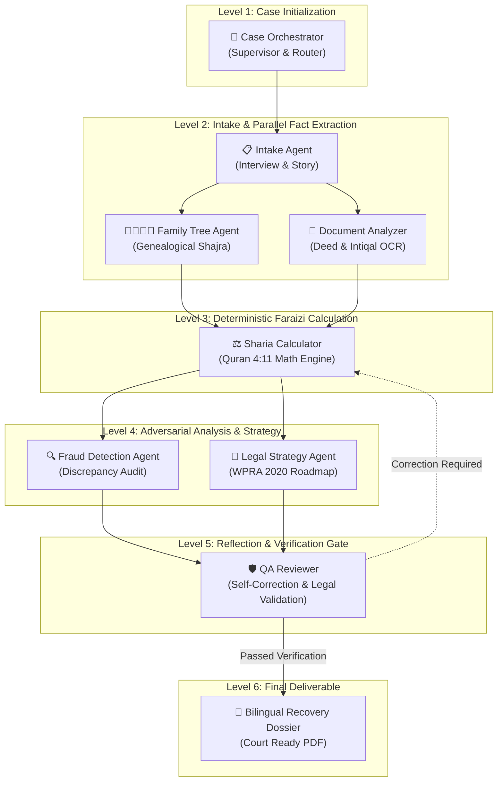
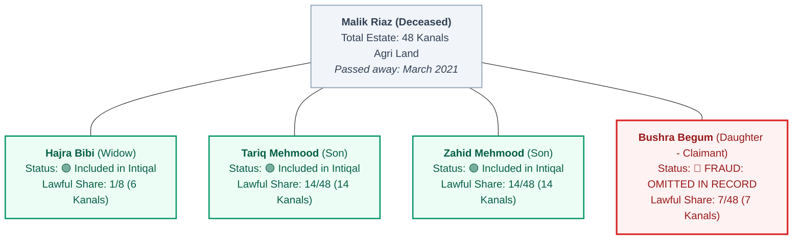

# HaqDar (حقدار) — Design System & UI Component Specification

> **Version:** 1.0.0  
> **Target Platform:** Web (Desktop & Mobile Responsive)  
> **Design Philosophy:** Institutional Civic-Tech / Judicial Grade (Clean, Light, Trustworthy — Non-Religious)  
> **Reference Stack:** Next.js / React 19, Tailwind CSS v3.4+, Lucide Icons, React Flow v11+

---

## 1. Design Language & Brand Identity

### 1.1 Brand Mission & Visual Tone
**HaqDar** (*"Rightful Owner / Claimant"*) is an AI-powered legal investigation platform built to restore lawful landed inheritance rights to women in Pakistan. 

The visual identity must command **institutional authority, forensic objectivity, and absolute legal trustworthiness**. 

#### Critical Visual Tenet: "Civic-Tech, Not Religious"
While the underlying mathematical rules derive from Islamic Faraizi inheritance jurisprudence, **the platform must NOT look like an Islamic or religious app**. There are no arabesques, no crescent motifs, no minarets, and no ornate calligraphy cards. Instead, HaqDar looks and behaves like an advanced civic-tech legal portal — akin to a High Court registry, an ombudsperson portal (e.g., UK GOV.UK, Singapore GovTech, or modern fintech platforms like Stripe and Carta).

```
┌────────────────────────────────────────────────────────────────────────┐
│                        VISUAL TONALITY MATRIX                          │
├────────────────────────────┬───────────────────────────────────────────┤
│ ❌ WHAT HAQDAR IS NOT      │  ✅ WHAT HAQDAR IS                        │
├────────────────────────────┼───────────────────────────────────────────┤
│ • Religious or mosque-like │  • Institutional, judicial & civic-grade  │
│ • Ornate or decorative     │  • Clean, utilitarian, data-dense         │
│ • Heavy dark hacker theme  │  • Crisp light mode with subtle cream/gray│
│ • Ambiguous chatbots       │  • Deterministic forensic investigation   │
│ • Emotional or polemical   │  • Objective legal proofs & citations     │
└────────────────────────────┴───────────────────────────────────────────┘
```

### 1.2 Core Design Principles
1. **Verifiable Transparency:** Every calculation, fraud alert, and legal roadmap step must cite exact statutory provisions (e.g., *Women's Property Rights Act 2020 § 4*, *Quran 4:11*, *Pakistan Penal Code § 498A*).
2. **Accessible Dignity:** Built for claimants and advocates under stress. Interfaces must be calm, readable, high-contrast, and available in English and Roman Urdu.
3. **Observability by Design:** Multi-agent operations are never hidden behind a generic loading spinner. The user sees which agent is active, its inputs, reasoning, and verified outputs.
4. **Deterministic Clarity:** Fractions, family trees, and financial values must have unambiguous visual hierarchy with monospace data tabularization.

---

## 2. Color System & Design Tokens

The palette is engineered for high legibility, strict WCAG 2.1 AA/AAA compliance, and subtle, authoritative contrast.

### 2.1 Complete Color Palette

| Token Name | Hex Code | Tailwind Equivalent | Use Case |
|---|---|---|---|
| **Primary Navy/Teal** | `#0B4F6C` | `primary-800` | Brand logo, primary buttons, major headings, key focal elements |
| **Primary Light** | `#14729B` | `primary-600` | Interactive hover states, active links, primary borders |
| **Primary Soft BG** | `#EDF6FA` | `primary-50` | Active selection tints, banner backgrounds, pill containers |
| **Secondary Amber/Gold** | `#C5832B` | `accent-600` | Official seals, verified badges, statutory citations, highlight accents |
| **Secondary Dim** | `#8F5B17` | `accent-800` | Border on golden badges, high-contrast accent text |
| **Secondary Warm BG** | `#FDF8EE` | `accent-50` | Legal quote callouts, statutory highlight cards |
| **Success Emerald** | `#059669` | `success-600` | Validated shares, QA-passed flags, completed agent badges |
| **Success Light BG** | `#ECFDF5` | `success-50` | Validated share rows, included heir node background |
| **Success Border** | `#A7F3D0` | `success-200` | Green card borders, verified heir outlines |
| **Danger Crimson** | `#DC2626` | `danger-600` | Fraud alerts, omitted heirs, forged document flags |
| **Danger Light BG** | `#FEF2F2` | `danger-50` | Fraud alert cards, omitted heir tree node background |
| **Danger Border** | `#FECACA` | `danger-200` | Fraud alert borders, critical anomaly outlines |
| **Warning Amber** | `#D97706` | `warning-600` | Missing documentation, agent paused / awaiting human input |
| **Warning Light BG** | `#FFFBEB` | `warning-50` | Advisory notices, missing record alerts |
| **Info / Active Cobalt**| `#2563EB` | `info-600` | Running / thinking agent state, in-flight data edges |
| **Info Light BG** | `#EFF6FF` | `info-50` | Agent thinking pill background, in-progress step highlight |
| **App Background** | `#F8FAFC` | `slate-50` | Primary viewport background (light, clean slate/cream) |
| **Surface White** | `#FFFFFF` | `white` | Standard cards, modal drawers, chat bubbles, sidebar panels |
| **Surface Muted Gray**| `#F1F5F9` | `slate-100` | Secondary card fills, table headers, code containers |
| **Border Subtle** | `#E2E8F0` | `slate-200` | Default card borders, dividers, React Flow edge lines |
| **Border Emphasized** | `#CBD5E1` | `slate-300` | Interactive input borders, container outlines |
| **Text Primary** | `#0F172A` | `slate-900` | Main body copy, headings, critical metrics (14.2:1 contrast) |
| **Text Secondary** | `#475569` | `slate-600` | Descriptive copy, agent metadata, timestamps |
| **Text Muted** | `#64748B` | `slate-500` | Footers, captions, inactive states, placeholder text |
| **Text Disabled** | `#94A3B8` | `slate-400` | Inactive buttons, disabled form fields |

### 2.2 Agent Status Color Tokens

Every agent in the HaqDar pipeline transitions through 5 strictly defined execution states:

```
┌───────────────┬──────────────┬──────────────┬─────────────────────────────────────┐
│ STATUS        │ BADGE COLOR  │ BACKGROUND   │ PULSE / ANIMATION BEHAVIOR          │
├───────────────┼──────────────┼──────────────┼─────────────────────────────────────┤
│ 1. Idle       │ #64748B      │ #F1F5F9      │ Static border, neutral badge        │
│ 2. Thinking   │ #2563EB      │ #EFF6FF      │ 1.5s infinite subtle breathing glow │
│ 3. Completed  │ #059669      │ #ECFDF5      │ Solid check badge, calm border      │
│ 4. Error      │ #DC2626      │ #FEF2F2      │ Alert badge, prominent red border  │
│ 5. Waiting    │ #D97706      │ #FFFBEB      │ Amber pause dot, waiting for input  │
└───────────────┴──────────────┴──────────────┴─────────────────────────────────────┘
```

### 2.3 Tailwind Configuration Export (`tailwind.config.ts`)

```typescript
import type { Config } from 'tailwindcss';

const config: Config = {
  content: [
    './pages/**/*.{js,ts,jsx,tsx,mdx}',
    './components/**/*.{js,ts,jsx,tsx,mdx}',
    './app/**/*.{js,ts,jsx,tsx,mdx}',
  ],
  theme: {
    extend: {
      colors: {
        brand: {
          50: '#edf6fa',
          100: '#d7ecf4',
          200: '#b4dbe9',
          300: '#82c0d8',
          400: '#4aa0c3',
          500: '#2b84a9',
          600: '#14729b',
          700: '#105c7d',
          800: '#0b4f6c', // Main Primary
          900: '#0c3f57',
          950: '#07283a',
        },
        gold: {
          50: '#fdf8ee',
          100: '#faedd2',
          200: '#f5daa5',
          300: '#eec16e',
          400: '#e6a43b',
          500: '#c5832b', // Secondary Accent
          600: '#a8651f',
          700: '#8f5b17',
          800: '#6c4314',
          900: '#4d2e0e',
        },
        status: {
          idle: '#64748b',
          running: '#2563eb',
          done: '#059669',
          error: '#dc2626',
          waiting: '#d97706',
        },
      },
      fontFamily: {
        sans: ['Inter', '-apple-system', 'BlinkMacSystemFont', 'Segoe UI', 'sans-serif'],
        mono: ['JetBrains Mono', 'ui-monospace', 'SFMono-Regular', 'Menlo', 'monospace'],
        nastaliq: ['Noto Nastaliq Urdu', 'Noto Sans Arabic', 'serif'],
      },
      boxShadow: {
        subtle: '0 1px 3px 0 rgba(15, 23, 42, 0.05), 0 1px 2px -1px rgba(15, 23, 42, 0.05)',
        card: '0 4px 6px -1px rgba(15, 23, 42, 0.06), 0 2px 4px -2px rgba(15, 23, 42, 0.04)',
        elevated: '0 10px 15px -3px rgba(15, 23, 42, 0.08), 0 4px 6px -4px rgba(15, 23, 42, 0.03)',
        highlight: '0 0 0 3px rgba(11, 79, 108, 0.15)',
        pulseGlow: '0 0 12px 2px rgba(37, 99, 235, 0.25)',
      },
      borderRadius: {
        subtle: '4px',
        card: '8px',
        panel: '12px',
        modal: '16px',
      },
    },
  },
  plugins: [],
};

export default config;
```

---

## 3. Typography System

### 3.1 Typeface Selection
- **Primary Body & UI Font:** `Inter` (Clean geometric grotesque sans-serif with tabular number support `tnum`).
- **Mathematical & Code Font:** `JetBrains Mono` or `ui-monospace` (Strict column alignment for fractions, Quranic citations, CNIC numbers, deed hashes, and mutation record IDs).
- **Urdu Script Font (Optional Calligraphic accents):** `Noto Nastaliq Urdu` or `Noto Sans Arabic` for formal statutory headings and bilingual display.
- **Roman Urdu Text:** Standard `Inter` with tailored grammatical casing.

### 3.2 Type Scale and Rhythm

```
┌────────────────────┬───────────┬─────────────┬──────────────┬────────────────────────┐
│ LEVEL              │ SIZE (PX) │ LINE HEIGHT │ WEIGHT       │ USAGE                  │
├────────────────────┼───────────┼─────────────┼──────────────┼────────────────────────┤
│ Display H1         │ 32px / 2rem│ 1.25 (40px) │ 700 Bold     │ Top Page Titles        │
│ Section H2         │ 24px/1.5rem│ 1.30 (32px) │ 600 SemiBold │ View Headers, Reports  │
│ Component H3       │ 18px/1.125│ 1.35 (24px) │ 600 SemiBold │ Card Headers, Sections │
│ Subheading H4      │ 15px/0.94r│ 1.40 (20px) │ 600 SemiBold │ Agent Node Titles      │
│ Body Regular       │ 14px /0.88│ 1.50 (22px) │ 400 Regular  │ Chat Text, Descriptions│
│ Body Medium        │ 14px /0.88│ 1.50 (22px) │ 500 Medium   │ Form Labels, Data Keys │
│ Body Small         │ 12px /0.75│ 1.40 (18px) │ 400 Regular  │ Metadata, Timestamps   │
│ Monospace Data     │ 13px /0.81│ 1.45 (20px) │ 500 Medium   │ Fractions (1/8, 7/24)  │
│ Overline / Badge   │ 11px /0.69│ 1.20 (14px) │ 700 Bold/Caps│ Severity Badges, Roles │
└────────────────────┴───────────┴─────────────┴──────────────┴────────────────────────┘
```

---

## 4. Spacing, Elevation & Layout Grid

### 4.1 Spacing Scale (8pt Grid System)
All margins, padding, and layout bounds conform strictly to standard units:
- `space-1`: `4px` (micro badges, inline icon gaps)
- `space-2`: `8px` (button internal padding-y, tag gaps)
- `space-3`: `12px` (card compact padding, message bubble gap)
- `space-4`: `16px` (standard card padding, list item gaps)
- `space-6`: `24px` (container internal padding, section breaks)
- `space-8`: `32px` (major component separations)
- `space-12`: `48px` (page section dividers)

### 4.2 Elevation, Borders & Shadows
HaqDar avoids heavy, blurry drop-shadows. Shadows are kept crisp and institutional, paired with 1px border outlines:
- **Flat Surface:** `bg-white border border-slate-200`
- **Hovered Item:** `bg-white border border-slate-300 shadow-subtle -translate-y-0.5 transition-all`
- **Active Card:** `bg-white border border-brand-300 shadow-card ring-2 ring-brand-100`
- **Elevated Modal / Tooltip:** `bg-white border border-slate-200 shadow-elevated`
- **Fraud Highlight Card:** `bg-red-50/50 border-l-4 border-l-danger-600 border-y border-r border-red-200`

---

## 5. Application Layout Architecture

### 5.1 Desktop View (Split-Screen 60 / 40 Workbench)
On desktop screens ($\ge 1024\text{px}$), HaqDar functions as a dual-pane forensic investigation workbench:
- **Left Pane (60% Width):** The Interactive Investigation Workspace (Chat intake, agent dialogue stream, human-in-the-loop input prompts).
- **Right Pane (40% Width):** The Forensic Evidence & Agent Pipeline Sidebar (Live React Flow pipeline graph, family tree node inspection, real-time inheritance share calculation, and fraud alert stack).
- **Top Header (Fixed 64px):** Logo, Active Case Identifier, Language Selector, Export Action button.

```
┌────────────────────────────────────────────────────────────────────────────────────────┐
│ [⚖️ HaqDar حقدار]  Case #HD-2026-0814  [Status: Active Investigation]  [EN|Roman Urdu]  │
├───────────────────────────────────────────────────┬────────────────────────────────────┤
│                    LEFT PANE (60%)                │             RIGHT PANE (40%)       │
│             Investigation Chat & Intake           │      Forensic Pipeline & Artifacts │
├───────────────────────────────────────────────────┼────────────────────────────────────┤
│                                                   │ [Pipeline Graph] [Tree] [Shares]   │
│ [Agent 🎯 Orchestrator]                           ├────────────────────────────────────┤
│ "Case initialized for Deceased: Malik Riaz..."    │  ┌──────────────────────────────┐  │
│                                                   │  │   🎯 ORCHESTRATOR [DONE]     │  │
│ [User]                                            │  └──────────────┬───────────────┘  │
│ "My brothers registered a fake Hiba in 2021..."   │                 ▼                  │
│                                                   │  ┌──────────────┴───────────────┐  │
│ [Agent 🔍 Fraud Detector]                         │  │  📋 INTAKE    │ 👨‍👩‍👧 TREE [RUN]  │  │
│ 🚨 CRITICAL FRAUD DETECTED:                       │  └──────────────┬───────────────┘  │
│ Omission of 2 daughters from Mutation #412        │                 ▼                  │
│                                                   │  ┌──────────────────────────────┐  │
│ [Human Input Required: Confirm NADRA details]     │  │  ⚖️ SHARIA ENGINE [WAIT]     │  │
│                                                   │  └──────────────────────────────┘  │
│ ┌───────────────────────────────────────────────┐ │ ────────────────────────────────── │
│ │ Type case evidence or answer agent...     [Send]│ │ 🚨 FRAUD ALERTS (2 Pending)      │
│ └───────────────────────────────────────────────┘ │ │ • Omitted Heir: Bushra (Daughter)│
└───────────────────────────────────────────────────┴────────────────────────────────────┘
```

### 5.2 Mobile Responsive View (< 1024px)
On mobile devices:
- The **Chat Interface** occupies 100% of the screen.
- A **Sticky Bottom Navigation Bar** or **Slide-over Bottom Sheet** allows instant switching between:
  1. `💬 Case Chat`
  2. `🕸️ Agent Pipeline`
  3. `🌳 Family Tree`
  4. `⚖️ Shares & Fraud`
- When an agent flags a critical fraud alert, a floating pill badge appears at the top: `🚨 2 Fraud Alerts Detected — View Analysis`.

---

## 6. Multi-Agent System & Avatar Specifications

HaqDar features 8 specialized agents coordinating under a supervisor architecture. Each agent has an assigned emoji, official title, functional role, and color identity.

```
┌────┬──────┬────────────────────────┬─────────────────────────┬────────────────────────┐
│ #  │ ICON │ AGENT NAME             │ ARCHITECTURAL ROLE      │ ACCENT COLOR           │
├────┼──────┼────────────────────────┼─────────────────────────┼────────────────────────┤
│ 1  │  🎯  │ Case Orchestrator      │ Supervisor & Router     │ #0B4F6C (Brand Teal)   │
│ 2  │  📋  │ Intake Agent           │ Structured Interviewer  │ #0284C7 (Sky Blue)     │
│ 3  │  👨‍👩‍👧‍👦│ Family Tree Agent      │ Genealogy (Shajra Nasab)│ #10B981 (Emerald)      │
│ 4  │  📄  │ Document Analyzer      │ Revenue Deed & Intiqal  │ #6366F1 (Indigo)       │
│ 5  │  ⚖️  │ Sharia Calculator      │ Faraizi Math Engine     │ #C5832B (Gold/Amber)   │
│ 6  │  🔍  │ Fraud Detection Agent  │ Omission & Forgery Flag │ #DC2626 (Crimson Red)  │
│ 7  │  📜  │ Legal Strategy Agent   │ Ombudsperson & WPRA 2020│ #7C3AED (Purple)       │
│ 8  │  🛡️  │ QA Reviewer            │ Reflection Gatekeeper   │ #059669 (Green Shield) │
└────┴──────┴────────────────────────┴─────────────────────────┴────────────────────────┘
```

### 6.1 Agent Execution Flow Architecture



---

## 7. Detailed Component Blueprints

### Component 1: Chat Interface & Message Bubbles

The chat interface provides a conversational legal interview experience. It distinguishes sharply between human claimants, orchestrator instructions, and agent analytical findings.

#### Visual Specifications:
- **User Messages:** Right-aligned, solid background `#0B4F6C` (Primary Navy), pure white text, rounded corners (`rounded-2xl rounded-tr-xs`), max width 75%.
- **Agent Messages:** Left-aligned, crisp white surface `#FFFFFF`, 1px border `#E2E8F0`, rounded corners (`rounded-2xl rounded-tl-xs`), max width 85%, shadow-subtle.
- **Agent Header in Bubble:** Flex container with 24px circular agent avatar badge, Agent Name in bold 13px slate-900, role pill, and formatted timestamp.
- **Typing / Agent Thinking Indicator:** Dedicated card showing the active agent icon, pulsing blue indicator, and descriptive status (e.g., *"Sharia Calculator is computing Asabah fractions for 3 sons and 2 daughters..."*).

```
┌────────────────────────────────────────────────────────────────────────┐
│ [👨‍👩‍👧‍👦 Family Tree Agent]  [GENEALOGY ENGINE]                   14:22 PM │
│                                                                        │
│ I have identified 5 primary legal heirs under Islamic Faraizi law:     │
│ • Hajra Bibi (Widow) — Entitled to 1/8 share (Quran 4:12)              │
│ • Tariq Mehmood (Son) — Residuary Asabah                               │
│ • Bushra Begum (Daughter) — ⚠️ Missing from Mutation Record #412       │
│                                                                        │
│ [Verified via NADRA Family Registration Certificate]                   │
└────────────────────────────────────────────────────────────────────────┘
```

#### Message Bubble CSS / Tailwind Tokens:
```html
<!-- Agent Message Bubble Sample -->
<div class="flex items-start gap-3 my-4 max-w-[85%]">
  <div class="flex-shrink-0 w-8 h-8 rounded-full bg-slate-100 border border-slate-200 flex items-center justify-center text-sm">
    👨‍👩‍👧‍👦
  </div>
  <div class="flex-1 bg-white border border-slate-200 rounded-2xl rounded-tl-none p-4 shadow-subtle">
    <div class="flex items-center justify-between mb-2">
      <div class="flex items-center gap-2">
        <span class="text-xs font-semibold text-slate-900">Family Tree Agent</span>
        <span class="text-[10px] uppercase font-bold px-1.5 py-0.5 rounded bg-sky-50 text-sky-700 border border-sky-200">Genealogy</span>
      </div>
      <span class="text-[11px] text-slate-400">14:22 PM</span>
    </div>
    <div class="text-sm text-slate-700 leading-relaxed">
      <!-- Body Text -->
    </div>
  </div>
</div>
```

---

### Component 2: Pipeline Sidebar (React Flow Node Architecture)

The pipeline sidebar gives real-time visibility into the multi-agent coordination. Built with React Flow, it displays agent nodes, execution order, dependency edges, and live statuses.

#### Agent Node Anatomy:
- **Card Container:** 240px width, 72px height, white surface `#FFFFFF`, rounded 8px (`rounded-lg`), 1.5px border matching agent status.
- **Node Left Border / Icon Badge:** 36px circular avatar container showing the agent emoji.
- **Node Title & Subtitle:** Title (12px bold slate-800), current status / operation label (11px slate-500).
- **Status Indicator Pill (Top Right):**
  - `IDLE`: Gray ring dot (`bg-slate-300`)
  - `RUNNING`: Pulsing blue dot with expanding radar wave (`bg-blue-600 animate-pulse`)
  - `COMPLETED`: Emerald check icon (`bg-emerald-600 text-white`)
  - `ERROR`: Crimson alert mark (`bg-red-600 text-white`)
  - `WAITING`: Amber clock indicator (`bg-amber-500 text-white`)

```
┌─────────────────────────────────────────────────────────┐
│  [🎯]  Case Orchestrator                       ● DONE   │
│        Intake routing completed (1.2s)                  │
└───────────────────────────┬─────────────────────────────┘
                            │ (Solid green edge)
                            ▼
┌─────────────────────────────────────────────────────────┐
│  [⚖️]  Sharia Calculator                    ◉ THINKING   │
│        Computing Quran 4:11 shares...                   │
└─────────────────────────────────────────────────────────┘
```

#### React Flow Node Styling Specification:
```typescript
// Custom AgentNode styling in React Flow
export const agentNodeStyles = {
  idle: "bg-white border-slate-200 text-slate-600",
  running: "bg-white border-blue-500 shadow-pulseGlow text-blue-900 ring-2 ring-blue-100",
  done: "bg-white border-emerald-400 text-emerald-950",
  error: "bg-white border-red-500 shadow-sm text-red-950",
  waiting: "bg-white border-amber-400 text-amber-950",
};
```

---

### Component 3: Family Tree Visualization (Interactive Shajra Nasab)

The family tree represents the deceased ancestor and all biological/legal descendants. Crucially, it highlights **systematic omissions** — female heirs excluded by corrupt local revenue records.

#### Node Anatomy & Semantic States:
1. **Included Legal Heir (Green State):**
   - Border: `2px solid #059669` (Emerald)
   - Background: `#ECFDF5`
   - Badge: `✓ INCLUDED IN INTIQAL`
   - Content: Name, Relationship (e.g., *Tariq Mehmood — Son*), Assigned Share.
2. **Omitted / Disinherited Female Heir (Critical Red State):**
   - Border: `2px solid #DC2626` (Crimson)
   - Background: `#FEF2F2`
   - Badge: `🚨 FRAUD: EXCLUDED FROM RECORD`
   - Highlight: Subtle red warning ring.
   - Content: Name, Relationship (e.g., *Bushra Begum — Daughter*), Lawful Share (*Entitled to 14.58%*), Status (*Missing from Shajra Nasab #412*).
3. **Deceased Ancestor / Non-Claimant (Neutral Gray State):**
   - Border: `1.5px solid #CBD5E1` (Slate)
   - Background: `#F1F5F9`
   - Badge: `DECEASED (2021)`
   - Content: Full Name, Year of Death, Estate Size.



---

### Component 4: Inheritance Share Display (Faraizi Proof Engine)

This component presents the mathematical inheritance breakdown. It proves without ambiguity that the shares are deterministic and derived from Quranic and statutory mandates.

#### Component Features:
- **Card Header:** Estate Summary (`Total Estate: PKR 48,000,000 / 48 Kanals`).
- **Tabular Monospace Breakdown:** Heir, Relationship, Quranic Category (*Sharer / Residuary*), Exact Quranic Fraction (`1/8`, `7/48`), Decimal Percentage (`12.50%`, `14.58%`), Physical Value (`PKR 6,000,000`), Record Status (*Claimed vs Lawful*).
- **Proportional Visual Bar Chart:** Segmented horizontal bar where each segment corresponds to an heir's share, colored green for lawfully assigned shares, gray for co-heirs, and striped crimson for stolen/omitted female shares.

```
┌────────────────────────────────────────────────────────────────────────────────────────┐
│ ⚖️ SHARIA INHERITANCE DISTRIBUTION PROOF                                               │
│ Estate Valuation: PKR 48,000,000 • 48 Kanals (Mauza Shahdara, Lahore)                   │
├───────────────────┬──────────────┬──────────────┬───────────┬──────────────┬───────────┤
│ HEIR NAME         │ RELATION     │ QURAN VERSE  │ FRACTION  │ PERCENTAGE   │ MONETARY  │
├───────────────────┼──────────────┼──────────────┼───────────┼──────────────┼───────────┤
│ Hajra Bibi        │ Widow        │ Surah 4:12   │ 1/8 (6/48)│ 12.50%       │ 6,000,000 │
│ Tariq Mehmood     │ Son          │ Surah 4:11   │ 14/48     │ 29.17%       │ 14,000,000│
│ Zahid Mehmood     │ Son          │ Surah 4:11   │ 14/48     │ 29.17%       │ 14,000,000│
│ Bushra Begum 🚨   │ Daughter     │ Surah 4:11   │ 7/48      │ 14.58%       │ 7,000,000 │
│ Zainab Bibi 🚨    │ Daughter     │ Surah 4:11   │ 7/48      │ 14.58%       │ 7,000,000 │
├───────────────────┴──────────────┴──────────────┴───────────┼──────────────┼───────────┤
│ TOTAL VERIFIED SHARES (Faraizi Exact Match):                │ 100.00%      │48,000,000 │
└─────────────────────────────────────────────────────────────┴──────────────┴───────────┘

Visual Share Bar:
[ Widow 12.5% ][   Son 1 29.2%   ][   Son 2 29.2%   ][🚨 Daughter 1 14.6%][🚨 Daughter 2 14.6%]
```

---

### Component 5: Fraud Alert Cards

When the Fraud Detection Agent detects illegal anomalies (e.g., omitted daughters, fake oral Hiba deeds, or Patwari collusion), it renders a prominent high-priority alert card.

#### Visual Architecture:
- **Left Accent Border:** 4px solid `#DC2626` (Crimson).
- **Background:** `#FEF2F2` (Soft red).
- **Top Row:** 
  - Severity Tag: `[🚨 CRITICAL FRAUD — OMITTED HEIR]` in bold 11px white text on `#DC2626` background.
  - Statutory Provision Tag: `PPC § 498A & WPRA 2020 § 4`
- **Anomaly Description:** High-contrast summary of the fraudulent transfer.
- **Forensic Evidence Box:** Comparison between NADRA Family Registration Certificate (FRC) and local Mutation Register (*Intiqal*).
- **Financial Deprivation Impact:** Explicit PKR and land area stolen from the claimant.
- **Recommended Enforcement Action:** Instant link to generate Ombudsperson petition.

```
┌────────────────────────────────────────────────────────────────────────┐
│ 🚨 CRITICAL FRAUD DETECTED                    [PPC § 498A | WPRA 2020] │
├────────────────────────────────────────────────────────────────────────┤
│ Title: Intentional Erasure of Female Heirs in Mutation Register #412   │
│                                                                        │
│ Forensic Evidence:                                                     │
│ • NADRA Record: Malik Riaz registered 2 daughters (Bushra & Zainab).   │
│ • Patwari Intiqal #412 (dated 14-Aug-2021): Mentions ONLY 2 sons.      │
│ • Fabricated Oral Hiba: Claimed sisters "verbally surrendered" rights. │
│                                                                        │
│ ⚠️ Lawful Deprivation:                                                 │
│ Claimant Bushra Begum has been unlawfully deprived of 7 Kanals         │
│ valued at PKR 7,000,000 (14.58% lawful estate).                        │
│                                                                        │
│ Recommended Legal Action:                                              │
│ Immediate summary eviction petition to the Ombudsperson for Protection │
│ of Women's Property Rights (60-day statutory resolution limit).        │
│                                                                        │
│ [Draft Ombudsperson Petition]             [Download Forensic Proof PDF]│
└────────────────────────────────────────────────────────────────────────┘
```

---

### Component 6: Legal Recovery Roadmap (Timeline Component)

A step-by-step judicial timeline that cuts through Pakistan's 20-year civil court delay by prioritizing fast-track remedies under the **Enforcement of Women's Property Rights Act 2020**.

#### Timeline Node Anatomy:
- **Step Badge:** Circle with Step Number (`01`, `02`, `03`) connected by vertical connecting track lines.
- **Action Title:** Bold 14px slate-900.
- **Statutory Forum:** Jurisdiction badge (e.g., `Provincial Ombudsperson`, `Revenue Officer / DC`, `High Court Writ`).
- **Estimated Timeline:** Expected turnaround (e.g., `15 to 30 Days` vs `15 Years Civil Court`).
- **Required Documents Checklist:** Mini-checklist with tick boxes for required attachments.

```
┌────────────────────────────────────────────────────────────────────────┐
│ 📜 FAST-TRACK LEGAL RECOVERY ROADMAP                                   │
│ Target Forum: Punjab Ombudsperson (WPRA 2020 Fast-Track Mechanism)      │
├────────────────────────────────────────────────────────────────────────┤
│                                                                        │
│  (01) ─── STEP 1: File Summary Complaint with Ombudsperson             │
│   │       Forum: Provincial Ombudsperson for Women's Property Rights   │
│   │       Statutory Limit: 60 Days max resolution time                 │
│   │       Required: NADRA FRC, Death Certificate, Mutation #412 copy   │
│   │                                                                    │
│  (02) ─── STEP 2: Ombudsperson Orders DC / Revenue Verification         │
│   │       Action: Deputy Commissioner summoned to produce Aks-Shajra   │
│   │       Fraud Flag: Patwari subject to inquiry under PEEDA Act       │
│   │                                                                    │
│  (03) ─── STEP 3: Cancellation of Fraudulent Mutation & Fresh Intiqal │
│   │       Action: Restoration of 7 Kanals directly in Bushra's name    │
│   │       Enforcement: Local Police assistance under Section 5 WPRA    │
│   │                                                                    │
│  (04) ─── STEP 4: Physical Partition or Rental Revenue Recovery        │
│           Remedy: Recovery of past 3 years' agricultural profits       │
└────────────────────────────────────────────────────────────────────────┘
```

---

### Component 7: Report Viewer & Language Toggle (English / Roman Urdu)

The Report Viewer formats all agent outputs into a publication-ready legal investigation dossier.

#### Key Specs:
- **Paper Style Container:** Max width 850px, centered, white background, subtle sheet shadow, clean printable margins (`p-8 md:p-12`).
- **Language Toggle Switch:** Segmented control button in header:
  - `[ English ]` | `[ Roman Urdu ]`
- **Real-Time Translation Support:** In Roman Urdu mode, all legal concepts and agent summaries switch seamlessly into phonetic, universally accessible Roman Urdu.

#### Bilingual Micro-Copy Dictionary:

| English Term | Roman Urdu Equivalent | Contextual Meaning |
|---|---|---|
| **Inheritance Share** | *Virasat ka Hisa* | The lawful portion of property |
| **Omitted Heir** | *Mehroom Waris (Chhupaya Gaya)* | Legitimate heir deleted from records |
| **Family Tree** | *Shajra Nasab* | Complete genealogical bloodline |
| **Mutation Register** | *Intiqal Record* | Official land registry transfer |
| **Fabricated Gift Deed** | *Jali Hiba Nama* | Forged document claiming surrender |
| **Ombudsperson** | *Mohtasib-e-Aala* | Statutory fast-track authority |
| **Lawful Owner** | *HaqDar (حقدار)* | The rightful claimant |
| **Legal Proof** | *Qanooni Saboot* | Deterministic mathematical evidence |
| **Case Investigation** | *Case ki Tehqeeqat* | Multi-agent examination |

---

### Component 8: PDF Download Button & Action Bar

The download action bar allows one-click export of the full forensic dossier for court filing, police complaints, or ombudsperson submissions.

#### Visual Specification:
- **Primary Action Button:**
  - Background: `#0B4F6C` (Primary Navy), text pure white, font-weight 600.
  - Hover: `#14729B` with 2px shadow-card.
  - Icon: Document download icon (`DownloadCloud` or `FileText`).
  - Label: `Download Court-Ready Dossier (PDF)`
  - Subtext: `Includes Sharia calculation proofs & statutory citations • 2.4 MB`
- **Secondary Action:** `Copy Case Summary Link` or `Print Official Brief`.

---

### Component 9: Language Selector Component

Located prominently in the application header:

```html
<!-- Language Selector Pill -->
<div class="inline-flex items-center p-1 bg-slate-100 rounded-lg border border-slate-200">
  <button class="px-3 py-1 text-xs font-semibold rounded-md bg-white text-slate-900 shadow-subtle transition-all">
    English
  </button>
  <button class="px-3 py-1 text-xs font-medium rounded-md text-slate-500 hover:text-slate-900 transition-all">
    Roman Urdu
  </button>
</div>
```

---

## 8. Layout Shell & Responsive Breakpoints

```css
/* Responsive Grid Breakpoints */
sm:  640px   /* Mobile landscape */
md:  768px   /* Tablet portrait */
lg:  1024px  /* Desktop split-pane threshold */
xl:  1280px  /* Widescreen workbench */
2xl: 1536px  /* Ultra-wide forensic view */
```

### 8.1 Desktop Structure (CSS Grid / Flexbox Blueprint)
```html
<div class="min-h-screen bg-slate-50 flex flex-col font-sans text-slate-900">
  <!-- Top Navigation Bar (Fixed 64px) -->
  <header class="h-16 bg-white border-b border-slate-200 px-6 flex items-center justify-between sticky top-0 z-50">
    <div class="flex items-center gap-3">
      <div class="w-9 h-9 rounded-lg bg-brand-800 text-white flex items-center justify-center font-bold text-lg">
        ⚖️
      </div>
      <div>
        <h1 class="font-bold text-base tracking-tight text-slate-900 flex items-center gap-2">
          HaqDar <span class="font-nastaliq text-xs text-brand-800">حقدار</span>
        </h1>
        <p class="text-[11px] text-slate-500">Autonomous Inheritance Rights Recovery Platform</p>
      </div>
    </div>
    
    <div class="flex items-center gap-4">
      <div class="hidden md:flex items-center gap-2 px-3 py-1 rounded-full bg-emerald-50 border border-emerald-200 text-emerald-800 text-xs font-medium">
        <span class="w-2 h-2 rounded-full bg-emerald-500"></span>
        Case #HD-2026-0814
      </div>
      <!-- Language Selector -->
      <div class="inline-flex p-0.5 bg-slate-100 rounded-lg border border-slate-200 text-xs font-medium">
        <button class="px-2.5 py-1 rounded bg-white shadow-xs font-semibold text-slate-900">EN</button>
        <button class="px-2.5 py-1 rounded text-slate-500 hover:text-slate-900">Roman Urdu</button>
      </div>
    </div>
  </header>

  <!-- Dual-Pane Workbench -->
  <main class="flex-1 flex flex-col lg:flex-row overflow-hidden">
    <!-- Left Pane: Chat & Intake (60%) -->
    <section class="w-full lg:w-[60%] flex flex-col border-r border-slate-200 bg-white">
      <div class="flex-1 overflow-y-auto p-6 space-y-4">
        <!-- Message Bubbles Stream -->
      </div>
      <!-- Chat Input Area -->
      <div class="p-4 border-t border-slate-200 bg-slate-50/50">
        <!-- Input Form -->
      </div>
    </section>

    <!-- Right Pane: Pipeline & Evidence Sidebar (40%) -->
    <aside class="w-full lg:w-[40%] flex flex-col bg-slate-50 overflow-y-auto">
      <div class="p-6 space-y-6">
        <!-- Pipeline React Flow Visualizer -->
        <!-- Family Tree Mini-Map -->
        <!-- Faraizi Shares Table -->
        <!-- Fraud Alert Stack -->
      </div>
    </aside>
  </main>
</div>
```

---

## 9. Accessibility & Inclusivity Standards (WCAG 2.1 AA)

1. **Color Contrast Ratios:**
   - Body text `#0F172A` on `#FFFFFF`: **15.4:1** (Exceeds WCAG AAA requirement of 7.0:1).
   - Secondary text `#475569` on `#FFFFFF`: **6.8:1** (Exceeds WCAG AA requirement of 4.5:1).
   - Primary Teal `#0B4F6C` on white: **8.3:1** (WCAG AAA compliant).
   - Crimson alert `#DC2626` on `#FEF2F2`: **5.1:1** (WCAG AA compliant).
2. **Non-Color Reliance:**
   - Fraud states are never indicated by red alone; they are always accompanied by textual badges (`🚨 FRAUD`), distinct icons (`AlertTriangle`), and border styles.
3. **Screen Reader Live Regions:**
   - The agent pipeline updates use `aria-live="polite"` so screen readers notify visually impaired users when an agent completes calculation without interrupting user input.
4. **Cognitive Ease:**
   - Complex legal jargon is accompanied by Roman Urdu tooltips and plain-language tooltips for rural/first-time legal claimants.

---

## 10. Summary Reference for Developers

When implementing components from this specification:
- **Theme:** Strictly Light Professional (`bg-slate-50` app background, `bg-white` card surfaces).
- **No religious visual clichés:** No crescents, minarets, or ornate arabesques. Clean legal-tech styling only.
- **Colors:** Deep Institutional Teal `#0B4F6C`, Sovereign Gold `#C5832B`, Emerald `#059669`, Crimson `#DC2626`.
- **Agents:** 8 specialized agents with defined emoji avatars and status indicators (Idle, Running, Completed, Error, Waiting).
- **Layout:** Desktop split-screen 60% Left (Chat) / 40% Right (Pipeline & Evidence Artifacts).
- **Language:** Instant seamless bilingual switching between English and Roman Urdu.
