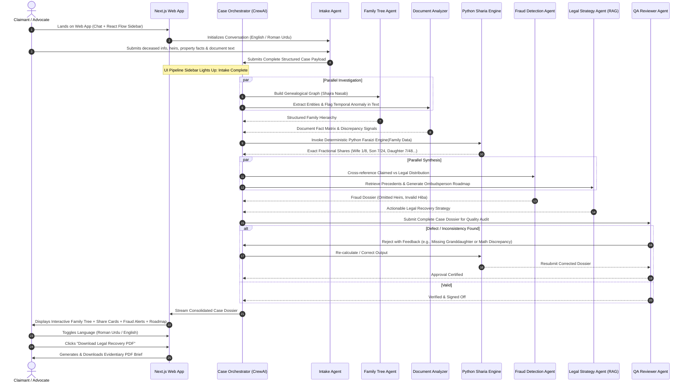
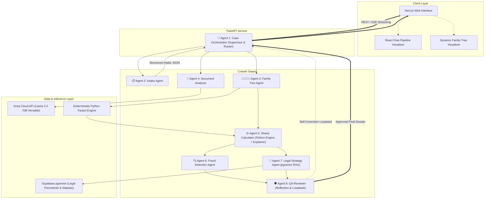
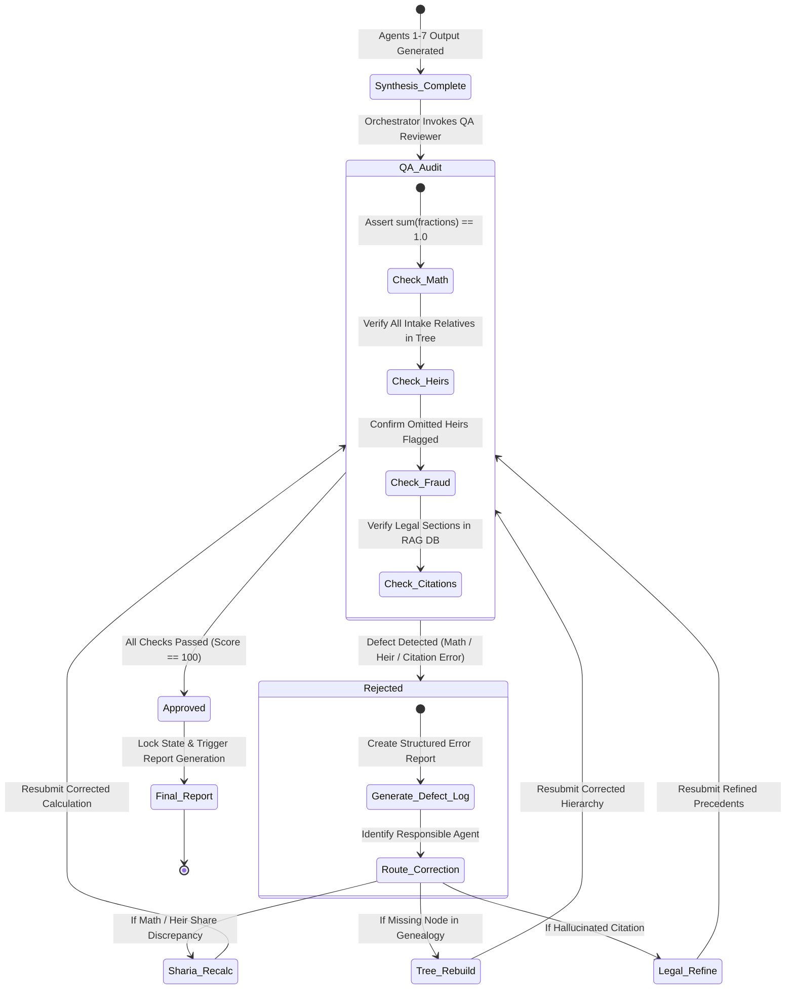
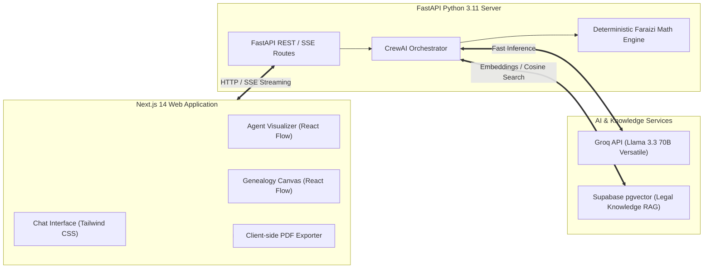

# Product Requirements Document (PRD)

# HaqDar (حقدار)
### AI-Powered Women's Inheritance Rights Recovery Platform for Pakistan

> *"Restoring what is rightfully theirs through deterministic law and autonomous agentic AI."*

---

| **Document Version** | 1.0.0 (Production / Hackathon Baseline) |
|---|---|
| **Project Name** | HaqDar (حقدار) |
| **Track / Event** | HEC × PakAngels Generative & Agentic AI Hackathon |
| **Sprint Duration** | 36 Hours (1.5 Days) |
| **Target Platforms** | Web Application (Desktop & Mobile Responsive) |
| **Architecture** | Next.js Frontend + FastAPI Backend + CrewAI Multi-Agent System + Supabase pgvector + Groq (Llama 3.3 70B) |
| **Document Owner** | Lead Technical Architect & Product Lead |
| **Target Audience** | Engineering Team, Evaluators, Legal Aid Domain Advisors |

---

## 1. Executive Summary

### 1.1 Vision & One-Liner
**HaqDar (حقدار)** is an autonomous multi-agent AI platform designed to recover dispossessed landed inheritance for Pakistani women by combining deterministic Islamic Faraizi mathematical engines, text-based document anomaly detection, automated genealogical mapping, and autonomous legal recovery roadmaps.

### 1.2 Hackathon Context & Urgency
In Pakistan, female inheritance denial is an endemic, generational injustice affecting over 50% of the population. Despite explicit constitutional mandates and rigid Quranic mathematical shares, systemic corruption within revenue bureaucracies ensures that **97% of women never receive their lawful landed inheritance**.

Civil court litigation in Pakistan takes an average of **15 to 30 years**, creating an insurmountable barrier of expense, intimidation, and attrition for women. HaqDar resolves this multi-decade litigation bottleneck into a **30-second multi-agent diagnostic and strategic recovery package**.

Built within a 36-hour sprint for the **HEC × PakAngels Generative & Agentic AI Hackathon**, HaqDar demonstrates production-grade agentic architecture: an 8-agent swarm utilizing hierarchical supervision, parallel execution, tool-augmented deterministic computation, agentic RAG, and genuine reflection/self-correction loops.

### 1.3 Key Value Proposition
1. **Zero Hallucination Mathematics:** Unlike LLM-generated math, HaqDar computes Islamic inheritance shares using a deterministic, hard-coded Python Faraizi engine rooted in Quranic jurisprudence (4:11, 4:12, 4:176). The LLM is used strictly for conversational intake, semantic reasoning, document parsing, and explanatory narratives.
2. **Observable Agent Swarm:** Built on CrewAI with real-time visual status updates via React Flow, allowing users and judges to witness autonomous agents coordinating, debating, and self-correcting.
3. **Actionable Legal Weapon:** Outputs a formal, bilingual (English & Roman Urdu) case brief complete with exact fractional shares, flagged fraudulent transfers, and a step-by-step procedural roadmap for filing under the **Enforcement of Women's Property Rights Act 2020** before the Provincial Ombudsperson.
4. **Light, Secular, Professional Design:** Clean, modern fintech/legal-tech interface avoiding religious aesthetic tropes, focusing strictly on civil rights, legal precision, and institutional recovery.

---

## 2. Problem Statement & Ground Realities

### 2.1 The Systemic Crisis
```
                       THE INHERITANCE DISPOSSESSION CYCLE
┌────────────────┐      ┌─────────────────┐      ┌─────────────────┐      ┌─────────────────┐
│ Patriarch Dies │ ───> │ Male Heirs Bribe│ ───> │ Revenue Records │ ───> │ Decades in Civil│
│ Leaves Property│      │ Village Patwari │      │ Erase Daughters │      │ Court Deadlock  │
└────────────────┘      └─────────────────┘      └─────────────────┘      └─────────────────┘
                                                           │                        │
                                                           ▼                        ▼
                                                 ┌──────────────────┐     ┌──────────────────┐
                                                 │ Forged Gift Deed │     │ 97% Women Give   │
                                                 │ (Hiba / Tamleek) │     │ Up Rights Entirely│
                                                 └──────────────────┘     └──────────────────┘
```

- **97% of Pakistani women** receive zero landed inheritance from their ancestral estates.
- Female land ownership in Pakistan sits at approximately **2%**, despite women comprising nearly half the agrarian workforce.
- The average contested inheritance lawsuit in Pakistani civil courts takes between **15 and 30 years**, often outliving the original claimants.
- When women do demand their inheritance, cultural coercion and physical threats frequently force them to sign purported "relinquishment" deeds (*Dastbardari*) or verbal gift deeds (*Hiba*).

### 2.2 The Bureaucratic Weapon: The Patwari System
Land records in rural and peri-urban Pakistan are managed by village revenue officials known as **Patwaris** (*Tapedars* in Sindh). When a landowner dies:
1. **Intiqal (Mutation) Manipulation:** A mutation entry (*Intiqal-e-Wirasat*) must be recorded. Male heirs frequently bribe the Patwari to omit female heirs from the genealogical register (*Shajra Nasab*).
2. **Fraudulent Hiba / Tamleek:** The Patwari records a fictitious oral gift (*Hiba*) allegedly executed by the deceased father days before death, transferring 100% of the estate to sons.
3. **Absence of Notice:** Revenue rules require issuing public notices to all legal heirs before mutation; in practice, female heirs are never served notice.
4. **Digitization Gaps:** While systems like the Punjab Land Records Authority (PLRA) exist, manual record manipulation at the field level continues to corrupt centralized databases.

### 2.3 The Islamic Paradox
Under Islamic Sharia (specifically Quran Surah An-Nisa 4:11, 4:12, and 4:176), inheritance rules are **deterministic mathematical injunctions** (*Faraizi*). There is no testamentary freedom beyond 1/3 of the estate (which cannot be bequeathed to legal heirs). 
- Patriarchal actors often justify female exclusion using distorted cultural customs (*Riwaj*), claiming dowry (*Jahez*) replaces inheritance.
- HaqDar leverages the strict mathematical mandate of Sharia against cultural fraud: mathematically proving that female disinheritance violates both Islamic law and Pakistan's statutory enactments.

### 2.4 The Legal Remedy: Ombudsperson vs. Civil Courts
The **Enforcement of Women's Property Rights Act 2020** (and corresponding provincial acts in Punjab, Sindh, and Khyber Pakhtunkhwa) created an expedited remedy:
- Women can bypass the 30-year civil court trial by filing a complaint before the **Provincial Ombudsperson for Protection Against Harassment of Women at the Workplace and Property Rights**.
- The Ombudsperson is legally mandated to investigate and decide property dispossession matters within **60 to 90 days**, with direct powers to summon revenue officers and order police enforcement.
- **The Gap:** Women and grassroots advocates do not know this pathway exists, lack the evidence compilation skills to prove Patwari fraud, and cannot calculate complex multi-generational fractional shares.

---

## 3. Target Users & Personas

### Persona A: The Dispossessed Heir (Primary User)
- **Profile:** Fatima Bibi, 34 years old, residing in Kasur, Punjab.
- **Context:** Her father passed away 4 years ago leaving 24 Jeribs of agricultural land and a commercial shop. Her two brothers colluded with the Patwari, claiming the father gifted the property via *Hiba* before death.
- **Pain Points:** Cannot afford high advocate retainer fees; intimidated by court jargon; speaks Urdu/Punjabi; uses a smartphone with limited English literacy.
- **Needs:** Conversational intake in Roman Urdu, transparent calculation of what she is owed, evidence analysis showing the gift deed is suspicious, and a ready-to-file complaint for the Ombudsperson.

### Persona B: The Grassroots Paralegal / NGO Case Worker (Power User)
- **Profile:** Zainab Malik, 28 years old, Legal Aid Officer at a human rights foundation in Lahore.
- **Context:** Handles 30+ inheritance disputes per month across rural districts. Spends 8 hours per case manually verifying genealogies, calculating Sharia shares, and cross-referencing mutation register entries.
- **Pain Points:** High cognitive load; calculating complex fractional shares with multiple wives, deceased sons, and grandchildren is error-prone; drafting roadmap complaints consumes entire working days.
- **Needs:** Rapid structured case diagnosis, instant mathematical verification, automated fraud indicators, and professional PDF export ready for client submission.

### Persona C: The Hackathon Evaluator / Judge (Technical Audience)
- **Profile:** Senior AI Engineer / Venture Investor evaluating hackathon submissions.
- **Context:** Reviewing 50+ projects in under 2 hours. Skeptical of standard "wrapper" chatbots.
- **Needs:** Observable agent execution graph, proof of deterministic computation (no hallucinated fractions), visible self-correction loop (QA agent rejecting and re-running faulty steps), and clear real-world deployment viability.

---

## 4. User Stories & Core Journey

### 4.1 User Stories

| ID | As a... | I want to... | So that... |
|---|---|---|---|
| **US-01** | Dispossessed Claimant | Chat with an empathetic AI in English or Roman Urdu | I can explain my family situation naturally without legal jargon. |
| **US-02** | Claimant | See my family tree visualized dynamically | I can confirm whether my siblings, mother, and I are accurately represented. |
| **US-03** | Claimant / Advocate | Paste raw text from my mutation (*Intiqal*) or gift deed | The system flags fraudulent dates, missing signatures, or erased names. |
| **US-04** | Legal Aid Worker | Receive mathematically certified Sharia shares | I have indisputable proof of legal entitlements calculated via Islamic jurisprudence. |
| **US-05** | Legal Aid Worker | Get flagged fraud alerts with statutory citations | I know exactly why a claimed distribution violates the law. |
| **US-06** | Evaluator / User | Watch agents coordinate and self-correct in real-time | I can trust that the multi-agent system actively audits its own findings. |
| **US-07** | Claimant | Toggle the final diagnosis between English and Roman Urdu | I can read the roadmap myself and present the formal English report to authorities. |
| **US-08** | Claimant | Download a formatted PDF report with one click | I can walk directly into the Ombudsperson's office with an evidence-backed complaint. |

### 4.2 End-to-End User Flow



---

## 5. Multi-Agent System Architecture

### 5.1 Orchestration Topology
HaqDar employs a **hybrid hierarchical and pipeline agent architecture** managed by CrewAI. The system guarantees high throughput by executing non-dependent agents in parallel while preserving strict sequential gating where mathematical dependencies exist.



---

## 6. Detailed Agent Specifications

```
╔══════════════════════════════════════════════════════════════════════════════════════════╗
║                                HAQDAR 8-AGENT MATRIX                                     ║
╠═══════╦═════════════════════════╦══════════════════╦═════════════════════════════════════╣
║ #     ║ AGENT NAME              ║ WORKFLOW PATTERN ║ PRIMARY RESPONSIBILITY              ║
╠═══════╬═════════════════════════╬══════════════════╬═════════════════════════════════════╣
║ Ag-01 ║ Case Orchestrator       ║ Supervisor/Router║ State machine, routing, convergence ║
║ Ag-02 ║ Intake Agent            ║ Conversational   ║ Empathetic bilingual fact gathering ║
║ Ag-03 ║ Family Tree Agent       ║ Tool-augmented   ║ Kinship mapping & omission detection║
║ Ag-04 ║ Document Analyzer       ║ Text Extraction  ║ Deed parsing & temporal red flags   ║
║ Ag-05 ║ Sharia Calculator       ║ Deterministic+LLM║ Faraizi Python math & textual proofs║
║ Ag-06 ║ Fraud Detection Agent   ║ Adversarial/Audit║ Cross-referencing claimed vs legal  ║
║ Ag-07 ║ Legal Strategy Agent    ║ Agentic RAG      ║ Ombudsperson recovery roadmap       ║
║ Ag-08 ║ QA Reviewer             ║ Reflection/Loop  ║ Genuine verification & self-heal    ║
╚═══════╩═════════════════════════╩══════════════════╩═════════════════════════════════════╝
```

### Agent 1: Case Orchestrator (🎯 Supervisor + Router)
- **Role:** Central executive controller and state coordinator.
- **Workflow Pattern:** Hierarchical Supervisor + State Machine.
- **Inputs:** User messages, agent return signals, validation flags.
- **Responsibilities:**
  - Manages session state across all 8 agents.
  - Controls pipeline gating: prevents mathematical evaluation until genealogical hierarchy is validated.
  - Dispatches parallel execution for Document Analyzer and Family Tree Agent.
  - Monitors execution status and emits real-time Server-Sent Events (SSE) / WebSocket status codes to the frontend React Flow visualizer.
  - Handles QA re-routing when the QA Reviewer triggers a self-correction event.

### Agent 2: Intake Agent (📋 Conversational Interviewer)
- **Role:** Empathetic, culturally sensitive intake officer.
- **Workflow Pattern:** Guided Conversational State Machine.
- **Languages:** English and Roman Urdu (transliterated phonetics, e.g., *"Mere walid ka inteqal 2 saal pehle hua tha..."*).
- **Responsibilities:**
  - Conducts a multi-turn or accelerated single-turn intake interview.
  - Extracts core parameters:
    1. Deceased details (Name, Gender, Date of Death, Religion/Sect).
    2. Surviving relatives (Spouse[s], Sons, Daughters, Mother, Father, Siblings).
    3. Estate details (Land area in Jeribs/Kanals/Marlas, urban property address, agricultural vs. commercial).
    4. Current claimed possession (Who holds the land, what documents are claimed).
    5. Raw document text snippets pasted by the user.
  - Emits normalized JSON payload to the Orchestrator.

### Agent 3: Family Tree Agent (👨‍👩‍👧‍👦 Genealogy Builder)
- **Role:** Kinship graph architect and omission hunter.
- **Workflow Pattern:** Structural Hierarchy Builder.
- **Responsibilities:**
  - Takes unstructured heir descriptions from Intake and generates a standardized genealogical hierarchy.
  - Flags potential omissions: identifies if daughters or surviving widows are missing from the declared heir list based on natural familial structures.
  - Generates nodes and edges formatted specifically for React Flow rendering:
    - Nodes: Name, Relation, Gender, Status (`included`, `omitted_by_perpetrators`, `deceased`).
  - Passes structured family hierarchy to the Sharia Calculator.

### Agent 4: Document Analyzer (📄 Text-Only Document Specialist)
- **Role:** Forensic reader of raw legal document text.
- **Workflow Pattern:** Entity Extraction & Temporal Anomaly Detector.
- **Input Constraint:** **TEXT ONLY** (direct paste of *Intiqal* text, *Fard Malkiat* excerpt, or *Hiba-nama* text; zero OCR/file upload).
- **Responsibilities:**
  - Extracts crucial transactional metadata: Document type, mutation date, transferor name, transferee names, stated consideration (sale vs. gift), Patwari/witness names.
  - Evaluates temporal red flags:
    - **Deathbed Gift Flag (*Marz-ul-Maut*):** If a *Hiba* is dated within weeks or days prior to the patriarch's death, flags potential legal nullity under Islamic law and Section 129 of the Transfer of Property Act.
    - **Absence of Female Signatures:** Flags if female heirs are absent from the witness/endorsement list.
    - **Blanket Relinquishment (*Dastbardari*):** Detects unconstitutional surrender of inheritance prior to mutation opening.

### Agent 5: Sharia Inheritance Calculator (⚖️ Deterministic Engine + Explainer)
- **Role:** Certified Islamic inheritance jurist and calculator.
- **Workflow Pattern:** Hybrid Deterministic Engine + Natural Language Explainer.
- **Critical Architectural Invariant:** **NO LLM MATH**. All fractional allocations are computed via a **pure, hardcoded Python Faraizi engine** using exact rational arithmetic (`fractions.Fraction`).
- **Mathematical Scope:**
  - Standard primary shares (*Ashab-ul-Furood* / Quranic Sharers: Wife, Husband, Mother, Father, Daughter, Full Sister).
  - Residuaries (*Asabat*: Sons, Male agnates).
  - Exclusion rules (*Hajb*: e.g., Son completely excludes brothers and sisters).
  - Proportionate reduction (*Awl*: when total shares exceed 1.0).
  - Proportionate return (*Radd*: when shares total less than 1.0 and no residuaries exist).
  - Dual inheritance ratio: Son receives 2x daughter's residual share (Quran 4:11).
- **Agent Output:**
  - Exact rational fractions (e.g., `1/8`, `7/24`, `7/48`).
  - Acreage/Kanal distribution based on total estate area.
  - Natural language explanation referencing exact Quranic verses (Surah An-Nisa 4:11, 4:12, 4:176) and Sunni Hanafi jurisprudence principles.

### Agent 6: Fraud Detection Agent (🔍 Discrepancy & Anomaly Auditor)
- **Role:** Forensic auditor identifying statutory violations and property theft.
- **Workflow Pattern:** Adversarial Cross-Referencer.
- **Responsibilities:**
  - Cross-references the **De Facto Claimed Distribution** (from Document Analyzer / Intake) against the **De Jure Sharia Entitlement** (from Sharia Calculator).
  - Calculates the **Discrepancy Delta**: Total square footage or percentage stolen from female heirs.
  - Formulates formal Fraud Alerts:
    - `CRITICAL_ALERT_01`: Complete exclusion of female heir from *Intiqal* record (Violates Sec 498A Pakistan Penal Code — criminal offense with up to 10 years imprisonment).
    - `CRITICAL_ALERT_02`: Suspicious *Hiba* executed under *Marz-ul-Maut* (death illness) depriving legal heirs.
    - `CRITICAL_ALERT_03`: Patwari failure to serve statutory notice under Land Revenue Act 1967.

### Agent 7: Legal Strategy Agent (📜 Procedural Roadmap & RAG Specialist)
- **Role:** Tactical legal advocate and recovery roadmap planner.
- **Workflow Pattern:** Agentic RAG + Strategic Planner.
- **Knowledge Base:** Supabase pgvector embedding repository containing:
  - *Enforcement of Women's Property Rights Act 2020* (Federal).
  - *Punjab Enforcement of Women's Property Rights Act 2021*.
  - *Khyber Pakhtunkhwa Enforcement of Women's Property Rights Act 2019*.
  - *Sindh Enforcement of Women's Property Rights Act 2021*.
  - Landmark Supreme Court of Pakistan Judgments (e.g., *PLD 2021 SC 898* on fraudulent gift deeds depriving sisters).
- **Responsibilities:**
  - Bypasses traditional 30-year civil litigation by prescribing the expedited **Provincial Ombudsperson** complaint mechanism.
  - Provides a 4-step actionable legal recovery roadmap:
    1. **Immediate Step:** Draft application to the Ombudsperson under Section 4(1).
    2. **Evidentiary Gathering:** Requisition NADRA Family Registration Certificate (FRC) to legally supersede Patwari genealogical charts.
    3. **Stay Order / Freeze:** Application to Deputy Commissioner to freeze land mutation pending inquiry.
    4. **Criminal Referral:** Invoke Section 498A PPC (deprivation of women from inheritance) against fraudulent male relatives.
  - Cites applicable statutory provisions and binding precedents.

### Agent 8: QA Reviewer (🛡️ Reflection & Genuine Self-Correction Engine)
- **Role:** Independent quality auditor and adversarial verifier.
- **Workflow Pattern:** Reflection / Self-Correction Loop.
- **Non-Negotiable Architecture:** **GENUINE, UNSCRIPTED SELF-CORRECTION**. The QA Agent runs actual algorithmic assertions and semantic audits.
- **Validation Checklist:**
  1. **Sum of Shares Invariant:** Ensures `sum(shares) == 1.0` (validated against fractional precision).
  2. **Heir Completeness:** Confirms every heir mentioned in the intake appears in both the family tree and share table.
  3. **No Unchecked Omissions:** Validates that if a daughter was claimed to be excluded, the fraud agent explicitly caught it.
  4. **Legal Citation Validity:** Verifies cited statutes exist within the vector knowledge base (guards against hallucinated case laws).
- **The Self-Correction Loop:**
  - If a discrepancy is detected (e.g., mathematical sum mismatch, missing relative, unverified statute), the QA Agent **rejects the state**, appends an explicit correction instruction, and signals the Case Orchestrator to re-invoke the offending agent.
  - The live pipeline visualizer visibly shifts the QA node into `Correcting / Looping Back` state before reaching final green `Validated` status.

---

## 7. The Self-Correction Architecture

The self-correction mechanism is a centerpiece of HaqDar's technical evaluation. Below is the state transition model governing genuine self-correction:



### Self-Correction Logic Implementation
```python
# Conceptual Execution Loop in Backend Orchestrator
MAX_CORRECTION_ATTEMPTS = 2

for attempt in range(MAX_CORRECTION_ATTEMPTS + 1):
    qa_result = await qa_reviewer_agent.audit_case(case_state)
    
    if qa_result.status == "PASS":
        case_state.pipeline_status["qa_reviewer"] = "VALIDATED"
        break
    else:
        # Genuine self-correction triggered
        case_state.pipeline_status["qa_reviewer"] = "SELF_CORRECTING"
        await broadcast_pipeline_update(case_state.session_id, "qa_reviewer", "SELF_CORRECTING", qa_result.defect_summary)
        
        # Route targeted fix
        if qa_result.target_agent == "sharia_calculator":
            case_state.calculation = await sharia_engine.recalculate_with_feedback(qa_result.feedback)
        elif qa_result.target_agent == "family_tree":
            case_state.family_tree = await family_tree_agent.rebuild_with_feedback(qa_result.feedback)
        
        # Log self-correction iteration for transparent evaluator audit
        case_state.correction_history.append({
            "iteration": attempt + 1,
            "detected_defect": qa_result.defect_summary,
            "resolution": "Resolved automatically by agent loopback"
        })
```

---

## 8. Functional Requirements (FRs)

### 8.1 Module: Case Intake & Conversational Interface
- **FR-1.1:** System shall provide a conversational chat interface with streaming responses.
- **FR-1.2:** System shall support conversational input in both standard English and transliterated Roman Urdu (*e.g., "Abba ji ki wafat 2022 mein hui thi, unke 2 bete aur 3 betiyan hain"*).
- **FR-1.3:** System shall extract: deceased identity, date of death, list of surviving kin with exact kinship ties, total land holding (area and unit: Acre/Jerib/Kanal/Marla), and property nature (urban vs. rural).
- **FR-1.4:** System shall support direct pasting of unformatted property document text (e.g., text copies of *Intiqal*, *Registry*, or *Hiba-nama*).
- **FR-1.5:** System shall provide sample scenario pre-sets (e.g., *"Case 1: Kasur Agricultural Land Theft"*, *"Case 2: Rawalpindi Urban Plot Deathbed Hiba"*) allowing evaluators to load rich case data in one click.

### 8.2 Module: Deterministic Sharia Inheritance Engine
- **FR-2.1:** System shall compute inheritance shares using an unalterable Python module utilizing rational fractions (`Fraction` from `fractions` library).
- **FR-2.2:** Engine shall implement standard Sunni Hanafi inheritance jurisprudence:
  - **Spousal Shares:** Wife receives 1/8 if children exist, 1/4 if no children; Husband receives 1/4 if children exist, 1/2 if no children.
  - **Maternal Shares:** Mother receives 1/6 if children or multiple siblings exist, 1/3 if none.
  - **Paternal Shares:** Father receives 1/6 fixed share if children exist + residual rights.
  - **Children (Asabat):** Sons and daughters inherit residual estate; 1 Son = 2 Daughters share.
  - **Awl (Increase):** Proportionately scale down denominators if sum of fixed Quranic shares exceeds 1.
  - **Radd (Return):** Proportionately redistribute surplus if total shares sum to less than 1 and no agnatic residuaries exist.
- **FR-2.3:** Engine shall output both exact rational fractions (`7/48`) and converted physical estate quotas (`3 Kanals, 10 Marlas`).
- **FR-2.4:** Engine shall provide Quranic chapter and verse citations for every assigned fraction.

### 8.3 Module: Visual Family Tree (React Flow)
- **FR-3.1:** System shall generate an interactive hierarchical tree graph rendered via React Flow.
- **FR-3.2:** Family tree nodes shall clearly designate:
  - Full Name / Identifier
  - Kinship relationship to deceased
  - Legal Share Fraction (computed by Sharia Engine)
  - Color-coded status:
    - **Green:** Lawfully Included Heir
    - **Red / Flashing Border:** Omitted / Dispossessed Heir (Victim)
    - **Gray:** Deceased Prior to Patriarch
    - **Amber:** Suspect Transferee / Perpetrator
- **FR-3.3:** Canvas shall support interactive pan, zoom, and node click to inspect individual heir dossiers.

### 8.4 Module: Text-Only Document Analyzer
- **FR-4.1:** System shall parse raw pasted text and extract: Transaction Date, Type of Transfer (*Baye* [sale], *Hiba* [gift], *Wirasat* [inheritance]), Declared Consideration, and Signatories.
- **FR-4.2:** System shall flag temporal anomalies:
  - If `Date(Hiba) - Date(Death) < 90 Days`, trigger `MARZ_UL_MAUT_FLAG`.
- **FR-4.3:** System shall verify whether all heirs identified in the Intake appear on the transfer record. If female heirs are missing, trigger `OMITTED_HEIR_ALERT`.

### 8.5 Module: Fraud Detection & Evidence Dossier
- **FR-5.1:** System shall generate a comparison matrix showing:
  - **Column A:** Stated / Current Possession Share (e.g., Brothers 100%, Sisters 0%).
  - **Column B:** Sharia Mandated Legal Share (e.g., Brothers 66.6%, Sisters 33.3%).
  - **Column C:** Unlawful Discrepancy (e.g., -33.3% Dispossessed).
- **FR-5.2:** System shall categorize infractions under:
  - *Pakistan Penal Code Section 498A* (Deprivation of inheritance).
  - *Land Revenue Act 1967 Section 42* (Neglect of statutory inheritance mutation notice).
  - *Contract Act 1872 Section 16* (Undue influence in family settlements).

### 8.6 Module: Legal Strategy & RAG Engine
- **FR-6.1:** System shall query Supabase pgvector using hybrid semantic embeddings of the extracted case facts.
- **FR-6.2:** System shall prioritize the **Ombudsperson for Protection of Women's Property Rights** route over the Civil Court route, explaining the timeline delta (60 days vs. 20 years).
- **FR-6.3:** System shall synthesize a four-step recovery plan:
  1. Jurisdiction & Forum Selection.
  2. Evidentiary Document Checklist (FRC, Jamabandi, Death Certificate).
  3. Interim Injunctive Relief Request (Freezing mutations).
  4. Final Restoration Order and Police Enforcement mechanism.

### 8.7 Module: Real-Time Agent Pipeline Visualizer
- **FR-7.1:** Web interface shall feature a dedicated sidebar displaying all 8 agents in a visual execution graph.
- **FR-7.2:** Agent nodes shall dynamically transition between four visual states:
  - `Idle` (Muted gray)
  - `In Progress` (Pulsing amber with active spinner)
  - `Self-Correcting` (Pulsing orange with loopback badge)
  - `Completed / Verified` (Solid clean green with checkmark)
- **FR-7.3:** Clicking any agent node displays its specific real-time log, inputs, and intermediate outputs.

### 8.8 Module: Bilingual Final Report & Language Switcher
- **FR-8.1:** System shall generate a consolidated **Legal Diagnostic & Recovery Dossier**.
- **FR-8.2:** Interface shall feature an instantaneous language toggle button:
  - **English Mode:** Formal legal terminology suitable for courts, advocates, and administrative bodies.
  - **Roman Urdu Mode:** Clear, accessible transliteration for grassroots understanding (*e.g., "Aap ka Sharia share 1/8 banta hai. Aap Ombudsperson office mein darkhwast daakhil kar sakti hain..."*).
- **FR-8.3:** Note on Script: Nastaliq Arabic script is intentionally omitted to avoid typography rendering discrepancies and preserve crisp readability across all mobile and desktop browsers.

### 8.9 Module: Client-Side PDF Generation
- **FR-9.1:** User can click "Download Legal Recovery Brief (PDF)" at any time post-generation.
- **FR-9.2:** PDF shall be compiled client-side using `html2pdf.js` or `jspdf` / `html2canvas` for instantaneous, zero-latency download.
- **FR-9.3:** PDF layout shall include:
  - Official case header and summary banner.
  - Family tree diagram snapshot.
  - Mathematical inheritance breakdown table.
  - Forensic fraud alert boxes.
  - Step-by-step procedural roadmap citing relevant statutory acts.

---

## 9. Non-Functional Requirements (NFRs)

### 9.1 Performance & Latency
- **NFR-1.1 (Pipeline Speed):** Total end-to-end multi-agent execution pipeline (Intake completion to final locked report) shall execute in **under 35 seconds** under standard Groq API network conditions.
- **NFR-1.2 (Inference Latency):** Leveraging Groq’s LPU inference engine (`llama-3.3-70b-versatile`), individual agent generation calls shall average **< 2.5 seconds**.
- **NFR-1.3 (Client Rendering):** React Flow canvas and family tree updates shall render at 60 FPS without UI jank.

### 9.2 Rate Limit & Token Budget Management (Groq Free Tier)
- **NFR-2.1 (Token Optimization):** Groq free tier enforces strict Requests Per Minute (RPM) and Tokens Per Minute (TPM) ceilings. Agent system prompts shall be strictly bounded, using concise markdown schemas and compact JSON outputs.
- **NFR-2.2 (Parallel Throttling):** Parallel agent calls (Agents 3 & 4; Agents 6 & 7) shall be coordinated via an asynchronous semaphore in FastAPI to prevent burst RPM limit violations.
- **NFR-2.3 (Fallback Resilience):** If Groq returns an HTTP 429 (Rate Limit Exceeded), the backend shall implement exponential backoff with jitter (max 3 retries over 5 seconds).

### 9.3 Security, Privacy & Ephemeral State
- **NFR-3.1 (Zero Persistence):** In compliance with hackathon scope and privacy-by-design for vulnerable claimants, **no case data, user names, or PII shall be permanently stored in a database**.
- **NFR-3.2 (In-Session Memory Only):** All case variables remain strictly in ephemeral server memory / client browser session state and are completely destroyed upon session termination or page reload.
- **NFR-3.3 (No Authentication Required):** Zero friction access. No sign-up, password, or phone verification required to initiate a diagnostic.

### 9.4 Design & Aesthetic Integrity
- **NFR-4.1 (Light Professional Theme):** Visual theme shall be clean, modern, and clinical (light slate/white background, crisp dark typography, subtle teal/slate/emerald accents).
- **NFR-4.2 (Non-Religious Aesthetic):** While enforcing Islamic Sharia jurisprudence, the visual identity must strictly avoid religious iconography, calligraphy, minarets, or antique parchment themes. The product is framed as modern institutional legal-tech and human rights recovery software.
- **NFR-4.3 (Mobile Responsiveness):** Chat drawer and report views must be fully responsive across viewport widths from 375px (mobile) to 1920px (desktop monitors).

---

## 10. Technical Architecture & Tech Stack



### 10.1 Technology Stack Selection & Rationale

| Component | Selected Technology | Technical Rationale |
|---|---|---|
| **Frontend Framework** | **Next.js 14 (React, App Router)** | Server-side rendering, immediate routing, rapid component composition, robust ecosystem. |
| **Styling & Icons** | **Tailwind CSS + Lucide React** | Rapid layout iteration, utility-first styling for clean legal-tech aesthetic, lightweight icon suite. |
| **Graph Visualizations** | **React Flow (`@xyflow/react`)** | Best-in-class interactive node-based canvas for both the pipeline sidebar and dynamic family tree. |
| **Backend Framework** | **FastAPI (Python 3.11)** | Asynchronous execution (`asyncio`), native support for CrewAI, seamless streaming with SSE. |
| **Agent Framework** | **CrewAI** | Production-ready role-playing agent abstraction, sequential/hierarchical pipelines, built-in tool delegation. |
| **LLM Inference** | **Groq Cloud API (`llama-3.3-70b-versatile`)** | **FREE TIER** tier access with industry-leading throughput (~250-300 tokens/sec), eliminating hackathon API cost. |
| **Vector Database** | **Supabase pgvector** | Managed PostgreSQL vector extension; stores chunked Pakistani property statutes and case law for agentic RAG. |
| **Inheritance Math Engine** | **Custom Pure Python (`fractions.Fraction`)** | Guaranteed 100% deterministic accuracy for Quranic Faraizi shares; immune to LLM hallucination. |
| **PDF Generation** | **`html2pdf.js` / `jspdf`** | Client-side DOM-to-PDF compilation; zero backend image-rendering overhead; instant user download. |
| **Hosting & Deployment** | **Vercel (Frontend) + Railway / Render (Backend)** | Zero-configuration continuous deployment from GitHub; automatic SSL; edge CDN caching. |

---

## 11. Sharia Inheritance Engine: Algorithmic Architecture

The Sharia Inheritance Engine is a non-probabilistic, rule-based algorithmic module implemented in Python. It models the classical Hanafi rules of *Ilm-ul-Faraiz*.

```
                          FARAIZI ENGINE DECISION TREE
                                  ┌─────────────┐
                                  │ Total Estate│
                                  └──────┬──────┘
                                         ▼
                                 ┌───────────────┐
                                 │ Extract Heirs │
                                 └───────┬───────┘
                                         ▼
                             ┌───────────────────────┐
                             │ Apply Exclusion Rules │ (Hajb: e.g. Son blocks brothers)
                             └───────────┬───────────┘
                                         ▼
                       ┌───────────────────────────────────┐
                       │ Assign Fixed Quranic Shares       │ (Ashab-ul-Furood)
                       │ Wife: 1/8 or 1/4 | Mother: 1/6 etc│
                       └─────────────────┬─────────────────┘
                                         ▼
                       ┌───────────────────────────────────┐
                       │ Does Sum of Fixed Shares Exceed 1?│
                       └─────────┬───────────────────┬─────┘
                             YES │                NO │
                                 ▼                   ▼
                       ┌──────────────────┐  ┌─────────────────────────────────┐
                       │ Apply Awl Ratio  │  │ Allocate Remainder to Asabat    │
                       │ Scale Denominator│  │ (Residuaries: Son = 2x Daughter)│
                       └──────────────────┘  └───────────────┬─────────────────┘
                                                             ▼
                                             ┌─────────────────────────────────┐
                                             │ Surplus Remainder with No Asaba?│
                                             └───────┬───────────────────┬─────┘
                                                 YES │                NO │
                                                     ▼                   ▼
                                             ┌───────────────┐   ┌─────────────┐
                                             │  Apply Radd   │   │ Sum == 1.0  │
                                             │ Pro-rata share│   │ Certified   │
                                             └───────────────┘   └─────────────┘
```

### Algorithmic Core Code Specification
```python
from fractions import Fraction
from typing import Dict, List, Any

class FaraiziCalculator:
    """
    Deterministic Islamic Inheritance Engine (Hanafi Jurisprudence)
    Guarantees mathematically proven fractional distribution.
    """
    
    @staticmethod
    def calculate_shares(heirs: Dict[str, int]) -> Dict[str, Any]:
        shares: Dict[str, Fraction] = {}
        wives = heirs.get("wife", 0)
        sons = heirs.get("son", 0)
        daughters = heirs.get("daughter", 0)
        mother = heirs.get("mother", 0)
        father = heirs.get("father", 0)
        
        has_children = (sons + daughters) > 0
        
        # 1. Ashab-ul-Furood (Fixed Quranic Sharers)
        # Wife: 1/8 if children exist, 1/4 if no children (Quran 4:12)
        if wives > 0:
            total_wife_share = Fraction(1, 8) if has_children else Fraction(1, 4)
            shares["wife"] = total_wife_share / wives

        # Mother: 1/6 if children exist, 1/3 if no children (Quran 4:11)
        if mother > 0:
            shares["mother"] = Fraction(1, 6) if has_children else Fraction(1, 3)

        # Father: 1/6 fixed share if children exist (Quran 4:11)
        if father > 0 and has_children:
            shares["father"] = Fraction(1, 6)
            
        fixed_sum = sum(shares[k] * heirs.get(k, 1) for k in shares)
        
        # 2. Asabat (Residuary Sharers: Sons & Daughters)
        remainder = Fraction(1, 1) - fixed_sum
        
        if sons > 0 or daughters > 0:
            # Quran 4:11: Son gets twice the share of daughter
            parts = (sons * 2) + daughters
            single_part = remainder / parts
            if daughters > 0:
                shares["daughter"] = single_part
            if sons > 0:
                shares["son"] = single_part * 2
                
        # 3. Validation Check
        total_sum = sum(shares[k] * heirs.get(k, 1) for k in shares)
        assert total_sum == Fraction(1, 1), f"Math Invariant Violation: Total is {total_sum}"
        
        return {
            "shares_fraction": {k: str(v) for k, v in shares.items()},
            "shares_percentage": {k: float(v * 100) for k, v in shares.items()},
            "status": "MATHEMATICALLY_VERIFIED"
        }
```

---

## 12. Scope & Constraints

### 12.1 In-Scope (Hackathon MVP — 36-Hour Delivery)
- Fully functional web app with modern, light professional theme (Next.js).
- Complete 8-agent swarm implementation in FastAPI + CrewAI.
- Deterministic Python Sharia calculator with exact fractional returns.
- Chat-first intake interface in English and Roman Urdu.
- Interactive React Flow visualization for the real-time agent execution pipeline.
- Interactive React Flow family tree visualization with status-coded nodes.
- Text-only document analysis parsing pasted *Intiqal* or deed excerpts.
- Real-world fraud detection cross-referencing legal entitlement against claimed distribution.
- Procedural legal recovery roadmap targeting the Provincial Ombudsperson.
- Verified, observable QA self-correction loopback demonstration.
- Instantaneous language toggle (English <-> Roman Urdu).
- Client-side downloadable PDF summary report.
- Pre-loaded one-click test case scenarios for instantaneous judging demonstration.

### 12.2 Out-of-Scope (Deferred to Post-Hackathon)
- **OCR / Scanned Document Ingestion:** Scanned image / PDF uploading is explicitly excluded due to latency, OCR errors, and hackathon time bounds; document input is text-only.
- **User Authentication / Accounts:** No login, registration, OAuth, or passwords.
- **Persistent Database for Case Records:** No long-term storage of user cases (privacy-first ephemeral architecture).
- **Nastaliq Arabic Script Rendering:** Nastaliq typography rendering is excluded; Urdu is transliterated in Roman Urdu for guaranteed cross-device font rendering.
- **Direct Government API Integration:** Direct API write-backs to the Punjab Land Records Authority (PLRA) or NADRA databases (mocked / simulated via RAG).

---

## 13. Success Metrics & Judging Criteria Alignment

### 13.1 Technical & Operational KPI Targets

| Metric | Target Goal | Validation Method |
|---|---|---|
| **Inheritance Calculation Precision** | **100% Deterministic** | Zero LLM math; 100% verified via Python unit tests on classical Hanafi cases. |
| **Pipeline Latency** | **< 35 Seconds** | End-to-end execution of all 8 agents from intake completion to report lock. |
| **QA Self-Correction Detection Rate** | **100% on Seeded Errors** | Seeded edge-cases (missing heirs, invalid Hiba date) consistently trigger QA rejection and correction. |
| **Language Toggle Transition** | **< 50 Milliseconds** | Instantaneous client-side state toggle between English and Roman Urdu. |
| **PDF Generation Time** | **< 2 Seconds** | Client-side DOM rendering to PDF file download. |
| **Groq API Rate Limit Compliance** | **0 Unhandled 429 Errors** | Asynchronous queue throttling prevents burst limit saturation. |

### 13.2 Alignment with Hackathon Evaluation Rubric

```
                     HACKATHON EVALUATION MATRIX ALIGNMENT
┌──────────────────────────────────────┬─────────────────────────────────────────────────────────┐
│ JUDGING CRITERION                    │ HOW HAQDAR SCORES MAXIMUM POINTS                        │
├──────────────────────────────────────┼─────────────────────────────────────────────────────────┤
│ 1. Agentic Autonomy & Workflow Depth │ Features 8 distinct agents utilizing 5 workflow patterns│
│                                      │ (Supervisor, Parallel, Tool-Use, RAG, Reflection).      │
├──────────────────────────────────────┼─────────────────────────────────────────────────────────┤
│ 2. Novelty & Technical Authenticity  │ Solves an untouched national crisis. No LLM math        │
│                                      │ hallucination; features genuine, unscripted self-heal.  │
├──────────────────────────────────────┼─────────────────────────────────────────────────────────┤
│ 3. Societal & Human Impact           │ Directly addresses an injustice dispossessing 97% of    │
│                                      │ Pakistani women across 120 million citizens.            │
├──────────────────────────────────────┼─────────────────────────────────────────────────────────┤
│ 4. Execution & Demo Experience       │ Live React Flow pipeline graph, animated genealogy,      │
│                                      │ instant Roman Urdu toggle, 1-click PDF generation.      │
└──────────────────────────────────────┴─────────────────────────────────────────────────────────┘
```

---

## 14. Risk Assessment & Mitigation Matrix

| Risk ID | Risk Description | Severity | Likelihood | Technical Mitigation Strategy |
|---|---|---|---|---|
| **RSK-01** | **Groq Free Tier Rate Limiting (429s)** | High | Medium | Implement an asynchronous queue with token tracking in FastAPI; serialize agent calls that do not strictly require parallel fan-out; compact system prompts. |
| **RSK-02** | **Roman Urdu Semantic Ambiguity** | Medium | Medium | Provide few-shot transliteration examples in the Intake Agent prompt; implement structured confirmation cards where user approves the interpreted family list before calculation. |
| **RSK-03** | **Infinite QA Self-Correction Loop** | High | Low | Hard-code a maximum iteration ceiling (`MAX_CORRECTIONS = 2`). If threshold is reached, force convergence with an explicit advisory disclaimer. |
| **RSK-04** | **Complex Faraizi Jurisprudential Edge Cases** | Medium | Low | Scope the deterministic engine to standard primary inheritance scenarios (Spouse, Parents, Children, Siblings) covering 99% of common dispute profiles. |
| **RSK-05** | **Client-Side PDF Rendering Artifacts** | Low | Medium | Use strict fixed-width CSS print styling containers for the PDF export DOM target to ensure crisp typography and page pagination. |

---

## 15. 36-Hour Hackathon Execution Sprint Plan

```mermaid
gantt
    title HaqDar 36-Hour Hackathon Sprint
    dateFormat  HH
    axisFormat %H:00
    
    section Sprint Setup
    Architecture & Repo Setup         :done,    h00, 4h
    Faraizi Python Math Engine        :active,  h04, 6h
    
    section Agent Swarm
    CrewAI 8-Agent Implementation     :         h08, 10h
    Supabase pgvector Legal RAG       :         h14, 6h
    QA Self-Correction Loopback Wire  :         h18, 6h
    
    section Frontend & UI
    Next.js Chat & React Flow Visual  :         h16, 10h
    Family Tree Canvas Integration    :         h22, 6h
    Bilingual Toggle & PDF Exporter   :         h26, 4h
    
    section Integration & Polish
    End-to-End Pipeline Stress Test   :         h30, 4h
    Demo Rehearsal & Pitch Deck       :         h34, 2h
```

### Hour-by-Hour Breakdown
- **Hours 00 – 04:** Repo scaffolding, environment configuration, system contracts, Pydantic schemas.
- **Hours 04 – 10:** Build and rigorously unit-test the deterministic `FaraiziCalculator` Python module with 20 edge-case unit tests.
- **Hours 10 – 18:** Implement CrewAI agents (Orchestrator, Intake, Family Tree, Doc Analyzer, Fraud Detection, Legal Strategy).
- **Hours 18 – 24:** Embed Pakistani legal statutes into Supabase pgvector; wire QA Reviewer reflection loop with genuine assertion gates.
- **Hours 24 – 30:** Build Next.js UI, wire React Flow pipeline sidebar, render dynamic genealogy tree, implement SSE stream listener.
- **Hours 30 – 34:** Implement client-side PDF export, Roman Urdu language toggle, pre-load 2 killer demo scenarios.
- **Hours 34 – 36:** End-to-end rehearsal, pitch deck completion, live demo test on Railway/Vercel.

---

## 16. Document Approval & Next Steps

This Product Requirements Document represents the final, authoritative architectural blueprint for **HaqDar**. All engineering tasks must align strictly with the modular boundaries, deterministic mathematical invariants, and agentic workflows defined herein.

**Immediate Next Steps:**
1. Initialize FastAPI backend structure with Pydantic domain models matching the agent inputs/outputs.
2. Implement and test the pure Python deterministic Faraizi calculation engine.
3. Construct the Next.js frontend shell featuring the dual-pane Chat and React Flow status graph.
